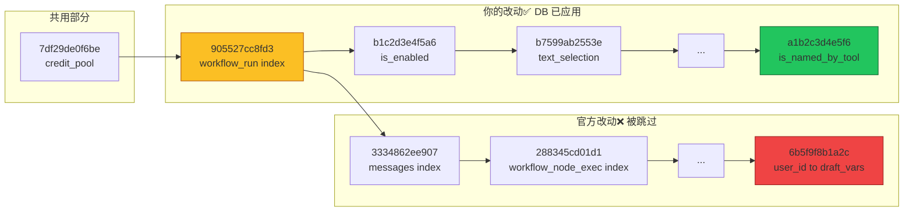
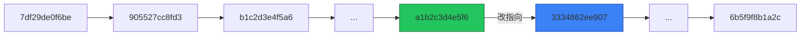

## 现象：upgrade-db 后，新表没出现

Dify 做了一次版本升级，merge 进官方最新改动后，执行 `flask db upgrade`，一切正常——没有报错，没有冲突。但新表就是没创建出来。

数据库 `alembic_version` 表显示当前版本是 `a1b2c3d4e5f6`。检查迁移文件都在，SQL 逻辑也正确。那为什么 Alembic 跳过了？

## 背景：迁移链的"多轨"状态

问题出在 merge 时的迁移链结构。仓库有两类迁移：

| 类型 | 命名风格 | 示例 |
|------|---------|------|
| 官方 | `YYYY_MM_DD_HHMM-HASH_desc.py` | `2026_01_09_1630-905527cc8fd3_add_workflow_run_created_at_id_idx.py` |
| 自定义 | `YYYY_MM_DD_HHMM-HASH_desc.py` 或 `YYYY_MM_DD_0001-desc.py` | `2026_02_25_0001-add_is_enabled_to_installed_apps.py` |

合并时，两类文件交错排布，形成了**分支点**。

## 诊断：三个关键信号

### 信号一：`flask db history` 的输出

```
...
7df29de0f6be -> 905527cc8fd3 (branchpoint), add workflow_run_created_at_id_idx
...
905527cc8fd3 -> 3334862ee907, feat: add created_at id index to messages   ← 官方链
...
905527cc8fd3 -> b1c2d3e4f5a6, add is_enabled to installed_apps             ← 自定义链
```

`905527cc8fd3` 后面跟了两个迁移——这是分支点的标志。

### 信号二：多个 head

输出底部有不止一个 `(head)` 标记：

```
0ec65df55790 -> 6b5f9f8b1a2c (head), ...   ← 官方链终点
8269b85dfa73 -> a1b2c3d4e5f6 (head), ...   ← 自定义链终点（DB 当前）
```

### 信号三：`alembic_version` 表

```sql
SELECT * FROM alembic_version;
-- a1b2c3d4e5f6
```

DB 已经 stamp 在自定义链的末端，Alembic 认为**这条链上的所有迁移都已经应用**，自然跳过另一条链。

## 根因：迁移图的分支结构

用 `flask db history` 的输出绘制迁移图：



核心问题：Alembic 的迁移图是**有向图**，不是线性列表。`905527cc8fd3` 作为分支点，后面有两条独立的路径。DB stamp 在自定义链末端，官方链就永远被绕过了。

## 修复：一刀切的线性化

### 方案

把官方链的起点 `3334862ee907` 的 `down_revision` 从 `905527cc8fd3` 改为自定义链的末端 `a1b2c3d4e5f6`。

### 修改前

```python
# 2026_01_12_1729-3334862ee907_feat_add_created_at_id_index_to_messages.py
revision = '3334862ee907'
down_revision = '905527cc8fd3'  # ← 指向分支点
```

### 修改后

```python
# 2026_01_12_1729-3334862ee907_feat_add_created_at_id_index_to_messages.py
revision = '3334862ee907'
down_revision = 'a1b2c3d4e5f6'  # ← 指向自定义链末端
```

### 修改后的线性链



## 验证

修改后重新运行 `flask db history`：

```
a1b2c3d4e5f6 -> 3334862ee907, feat: add created_at id index to messages
```

只有一个 head，链是线性的。然后：

```bash
flask db upgrade
```

所有官方迁移按序执行，新表创建成功。

## 总结

| 要点 | 说明 |
|------|------|
| **根因** | Alembic 迁移图是 DAG，分支点导致平行路径 |
| **信号** | `flask db history` 输出中的 `(branchpoint)` 和多个 `(head)` |
| **修复** | 只需改 1 行：把官方链起点的 `down_revision` 指向自定义链末端 |
| **验证** | 改后只有一个 head，`flask db upgrade` 正常执行全部迁移 |

**教训**：merge 迁移文件时，不要只看文件内容有没有冲突。用 `flask db history` 看一眼迁移图结构——如果出现 `(branchpoint)` 或多个 `(head)`，就需要手动调整 `down_revision` 来保持线性。
