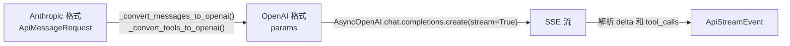
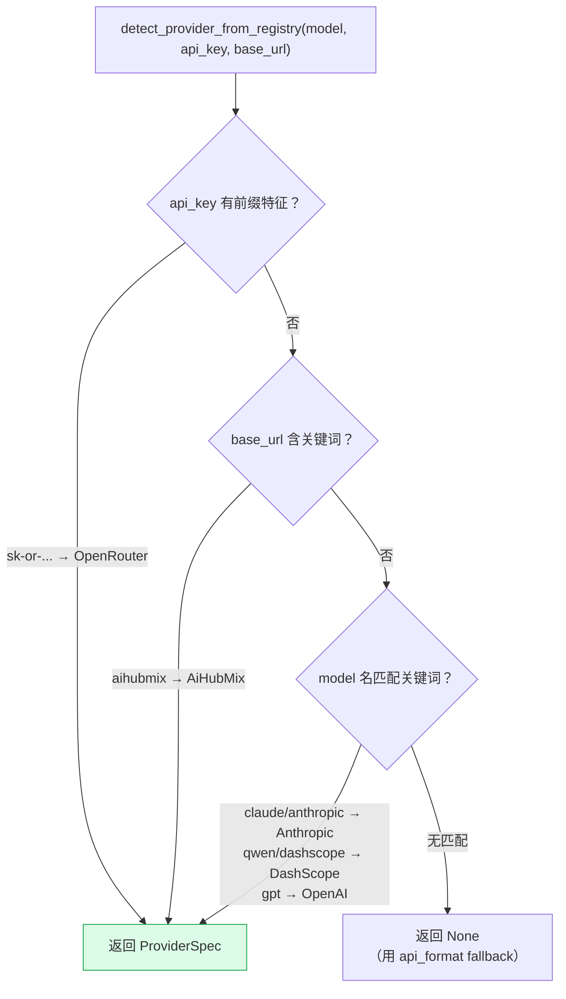
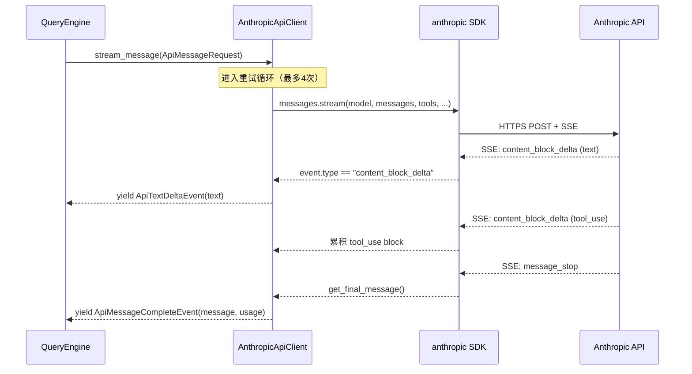

## 架构概览

OpenHarness 的内部设计是 **Anthropic 格式优先**——消息历史、工具定义都使用 Anthropic 的数据结构。要支持其他提供商（OpenAI、Gemini、DeepSeek 等），需要一个格式转换层。整个架构通过 `SupportsStreamingMessages` 协议把 QueryEngine 与具体的 Client 实现解耦：

```
QueryEngine
    │
    │  只依赖这个协议
    ▼
SupportsStreamingMessages (Protocol)
    │
    ├── AnthropicApiClient    ← Anthropic SDK（claude-* 模型）
    ├── OpenAICompatibleClient← OpenAI SDK + 格式转换（OpenAI/Gemini/DeepSeek/...）
    ├── CopilotClient         ← 包装 OpenAICompatibleClient + Copilot OAuth 头
    └── CodexClient           ← 直接 httpx（chatgpt.com 订阅 API）
```

---

## SupportsStreamingMessages：统一协议

> **文件**: `src/openharness/api/client.py`

```python
class SupportsStreamingMessages(Protocol):
    async def stream_message(
        self, request: ApiMessageRequest
    ) -> AsyncIterator[ApiStreamEvent]:
        """Yield streamed events for the request."""
```

`QueryEngine` 只依赖这个协议，不关心底层是哪个 LLM 提供商。

**请求**（`ApiMessageRequest`）：

```python
@dataclass(frozen=True)
class ApiMessageRequest:
    model: str
    messages: list[ConversationMessage]  # Anthropic 格式
    system_prompt: str | None = None
    max_tokens: int = 4096
    tools: list[dict[str, Any]] = field(default_factory=list)  # Anthropic tool schema
```

**响应事件**（`ApiStreamEvent`）：

```python
ApiTextDeltaEvent     # 流式文本增量 {text: str}
ApiMessageCompleteEvent  # 完整消息 {message, usage}
ApiRetryEvent         # 重试通知 {message, attempt, delay_seconds}
```

---

## 三种核心 Client 实现

### AnthropicApiClient：原生 Anthropic SDK

> **文件**: `src/openharness/api/client.py`

直接封装 `anthropic.AsyncAnthropic` SDK，**无需格式转换**——内部表示就是 Anthropic 格式。

```python
class AnthropicApiClient:
    def _create_client(self) -> AsyncAnthropic:
        kwargs = {}
        if self._api_key:    kwargs["api_key"] = self._api_key
        if self._auth_token: kwargs["auth_token"] = self._auth_token
        if self._base_url:   kwargs["base_url"] = self._base_url
        return AsyncAnthropic(**kwargs)

    async def _stream_once(self, request: ApiMessageRequest):
        params = {
            "model": request.model,
            "messages": [msg.to_api_param() for msg in request.messages],
            "max_tokens": request.max_tokens,
            "system": request.system_prompt,
            "tools": request.tools,  # ← Anthropic format，直接用
        }
        # claude_oauth 时用 beta.messages，否则用 messages
        stream_api = self._client.beta.messages if self._claude_oauth else self._client.messages
        async with stream_api.stream(**params) as stream:
            async for event in stream:
                if event.type == "content_block_delta" and event.delta.type == "text_delta":
                    yield ApiTextDeltaEvent(text=event.delta.text)
            final = await stream.get_final_message()
            yield ApiMessageCompleteEvent(message=assistant_message_from_api(final), ...)
```

**认证方式**：
- `ANTHROPIC_API_KEY` 环境变量 / 直接传 `api_key`
- Claude OAuth（`claude_oauth=True`）：添加 beta header，使用 beta.messages API

---

### OpenAICompatibleClient：格式转换层

> **文件**: `src/openharness/api/openai_client.py`

封装 `openai.AsyncOpenAI` SDK，**需要双向格式转换**。



#### 工具格式转换

```python
def _convert_tools_to_openai(tools: list[dict]) -> list[dict]:
    # Anthropic:  {"name": "...", "description": "...", "input_schema": {...}}
    # OpenAI:     {"type": "function", "function": {"name": "...", "parameters": {...}}}
    return [{
        "type": "function",
        "function": {
            "name": tool["name"],
            "description": tool.get("description", ""),
            "parameters": tool.get("input_schema", {}),  # ← input_schema → parameters
        },
    } for tool in tools]
```

#### 消息格式转换

| 格式差异 | Anthropic | OpenAI |
|---|---|---|
| 系统提示 | 独立参数 `system_prompt` | `{role: "system", content: ...}` 放在 messages 第一条 |
| 工具调用 | assistant message 里的 `ToolUseBlock` | assistant message 上的 `tool_calls` 字段 |
| 工具结果 | user message 里的 `ToolResultBlock` | 独立的 `{role: "tool", tool_call_id: ..., content: ...}` message |

```python
def _convert_messages_to_openai(messages, system_prompt):
    openai_messages = []
    # 系统提示变成第一条 message
    if system_prompt:
        openai_messages.append({"role": "system", "content": system_prompt})

    for msg in messages:
        if msg.role == "assistant":
            # ToolUseBlock → tool_calls 字段
            ...
        else:
            # user message: ToolResultBlock → 独立 tool message
            ...
    return openai_messages
```

#### 特殊 token 参数处理

GPT-5、o1、o3、o4 系列要求用 `max_completion_tokens` 而不是 `max_tokens`：

```python
_MAX_COMPLETION_TOKEN_MODEL_PREFIXES = ("gpt-5", "o1", "o3", "o4")

def _token_limit_param_for_model(model, max_tokens) -> dict:
    normalized = model.strip().lower().rsplit("/", 1)[-1]
    if normalized.startswith(_MAX_COMPLETION_TOKEN_MODEL_PREFIXES):
        return {"max_completion_tokens": max_tokens}
    return {"max_tokens": max_tokens}
```

---

### CopilotClient：GitHub Copilot

> **文件**: `src/openharness/api/copilot_client.py`

Copilot API 本质上是 OpenAI-compatible 的，所以 `CopilotClient` 直接**委托给 `OpenAICompatibleClient`**，只添加 Copilot 特有的配置：

```python
class CopilotClient:
    def __init__(self, github_token=None, enterprise_url=None):
        auth_info = load_copilot_auth()
        token = github_token or auth_info.github_token

        copilot_headers = {
            "Editor-Version": f"openharness/{_VERSION}",
            "Copilot-Integration-Id": "openharness",
            "Authorization": f"Bearer {token}",
        }
        base_url = copilot_api_base(enterprise_url)

        self._inner = OpenAICompatibleClient(
            api_key=token,
            base_url=base_url,
            default_headers=copilot_headers,  # ← Copilot 专属 header
        )

    async def stream_message(self, request):
        async for event in self._inner.stream_message(request):
            yield event
```

**认证流程**：GitHub OAuth device flow → 持久化 token 到 `~/.openharness/copilot_auth.json`

---

### CodexClient：OpenAI Codex 订阅

> **文件**: `src/openharness/api/codex_client.py`

直接使用 `httpx`（而非 OpenAI SDK），连接 `chatgpt.com/backend-api/codex/responses`，面向 ChatGPT Plus/Pro 订阅用户。

**认证**：JWT token（从 `chatgpt_account_id` claim 提取账号 ID）

---

## 提供商注册表（Provider Registry）

> **文件**: `src/openharness/api/registry.py`

所有支持的提供商定义在 `PROVIDERS` 元组里，是**唯一的数据来源**——检测逻辑、显示名称、认证类型全部从这里读取：

```python
@dataclass(frozen=True)
class ProviderSpec:
    name: str                  # 规范名称
    keywords: tuple[str, ...]  # 模型名关键词（小写）
    env_key: str               # API Key 环境变量名
    display_name: str          # UI 显示名
    backend_type: str          # "anthropic" | "openai_compat" | "copilot"
    default_base_url: str      # 默认 base URL
    detect_by_key_prefix: str  # API Key 前缀特征（如 "sk-or-"）
    detect_by_base_keyword: str# base_url 关键词
    is_gateway: bool           # 是否为聚合网关
    is_local: bool             # 是否本地部署
    is_oauth: bool             # 是否 OAuth 认证
```

### 内置提供商一览

<CardGroup cols={2}>
  <Card title="Anthropic（原生）" icon="robot">
    claude-* 系列，使用 Anthropic SDK，`backend_type="anthropic"`
  </Card>
  <Card title="OpenAI" icon="microchip">
    gpt-*/o1/o3/o4 系列，`OPENAI_API_KEY`
  </Card>
  <Card title="DeepSeek" icon="code">
    deepseek-* 系列，`DEEPSEEK_API_KEY`
  </Card>
  <Card title="Google Gemini" icon="sparkles">
    gemini-* 系列，`GEMINI_API_KEY`
  </Card>
  <Card title="DashScope（阿里云）" icon="cloud">
    qwen-* 系列，`DASHSCOPE_API_KEY`
  </Card>
  <Card title="VolcEngine（火山引擎）" icon="fire">
    Ark 平台，`OPENAI_API_KEY` + volcengine base_url
  </Card>
  <Card title="SiliconFlow（硅基流动）" icon="bolt">
    聚合网关，多种模型
  </Card>
  <Card title="OpenRouter" icon="route">
    key 前缀 `sk-or-` 自动识别
  </Card>
  <Card title="AWS Bedrock" icon="server">
    `AWS_ACCESS_KEY_ID`
  </Card>
  <Card title="Ollama（本地）" icon="house">
    `http://localhost:11434/v1`，is_local=True
  </Card>
  <Card title="GitHub Copilot" icon="github">
    OAuth，`backend_type="copilot"`
  </Card>
  <Card title="OpenAI Codex" icon="terminal">
    chatgpt.com 订阅，JWT 认证
  </Card>
</CardGroup>

---

## 提供商自动检测

> **文件**: `src/openharness/api/registry.py` → `detect_provider_from_registry()`

三级优先级匹配：



```python
def detect_provider_from_registry(model, api_key=None, base_url=None):
    # 1. API Key 前缀（最高优先级）
    if api_key:
        for spec in PROVIDERS:
            if spec.detect_by_key_prefix and api_key.startswith(spec.detect_by_key_prefix):
                return spec
    # 2. base_url 关键词
    if base_url:
        base_lower = base_url.lower()
        for spec in PROVIDERS:
            if spec.detect_by_base_keyword and spec.detect_by_base_keyword in base_lower:
                return spec
    # 3. 模型名关键词（PROVIDERS 顺序即优先级）
    if model:
        return _match_by_model(model)
    return None
```

---

## 重试与错误处理

两个主要 Client（`AnthropicApiClient`、`OpenAICompatibleClient`）都有相同的重试策略：

```
MAX_RETRIES = 3
BASE_DELAY = 1.0s
MAX_DELAY = 30.0s
退避算法：delay = min(BASE_DELAY × 2^attempt, MAX_DELAY) + 随机 jitter (0~25%)
```

**可重试错误**：HTTP 429/500/502/503/529、网络超时、连接错误

**不可重试错误**：`OpenHarnessApiError`（认证失败等）

```
错误层级：
OpenHarnessApiError (base)
├── AuthenticationFailure  ← 401/认证问题，不重试
├── RateLimitFailure       ← 429，用 Retry-After header 算 delay
└── RequestFailure         ← 其他传输错误，可重试
```

重试时向上游 yield `ApiRetryEvent`，QueryEngine 收到后显示状态提示（`"Request failed; retrying in 2.3s..."`）。

---

## 完整调用链



---

## 关键代码位置速查

| 功能 | 文件 |
|------|------|
| 协议定义 + AnthropicApiClient | `src/openharness/api/client.py` |
| OpenAI 兼容 Client + 格式转换 | `src/openharness/api/openai_client.py` |
| CopilotClient | `src/openharness/api/copilot_client.py` |
| CodexClient（httpx） | `src/openharness/api/codex_client.py` |
| 提供商注册表 | `src/openharness/api/registry.py` |
| 提供商检测逻辑 | `src/openharness/api/provider.py` |
| 错误类型 | `src/openharness/api/errors.py` |
| 用量统计 | `src/openharness/api/usage.py` |
| 消息格式（to_api_param） | `src/openharness/engine/messages.py` |
