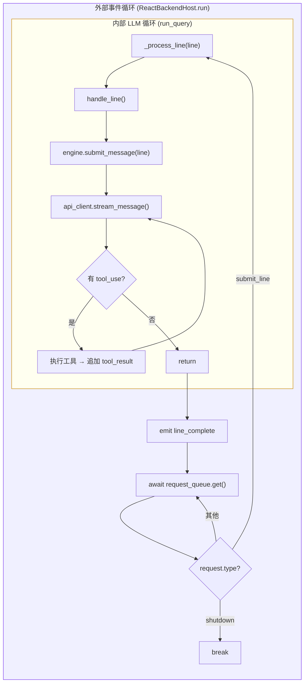
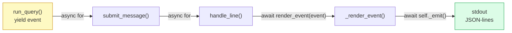

## 概述

OpenHarness 的后端运行着**两个嵌套循环**，它们各司其职：

- **外部事件循环** — `ReactBackendHost.run()` 中的 `while self._running`，负责接收前端请求、分发处理
- **内部 LLM 循环** — `QueryEngine.run_query()` 中的 `while turn_count < max_turns`，负责驱动 LLM 与工具的多轮交互

理解这两个循环的边界和协作方式，是理解整个 Agent 架构的关键。

---

## 全局视角



---

## 外部事件循环

> **位置**: `src/openharness/ui/backend_host.py` — `ReactBackendHost.run()`

### 职责

外部循环是**请求调度器**——它的工作是等待前端发来的请求，然后分发处理。

### 运行方式

```python
while self._running:
    request = await self._request_queue.get()  # ← 阻塞等待
    
    if request.type == "shutdown":
        break
    elif request.type == "submit_line":
        self._busy = True
        try:
            should_continue = await self._process_line(request.line)
        finally:
            self._busy = False
    # ... 其他请求类型
```

### 特征

| 特征 | 说明 |
|------|------|
| **生命周期** | 从后端启动到关闭，贯穿整个会话 |
| **驱动方式** | 由前端请求驱动（`asyncio.Queue`） |
| **单次迭代** | 处理一个用户请求 |
| **退出条件** | `shutdown` 请求 或 `should_continue = False` |
| **并发控制** | `self._busy` 标志防止重入 |
| **请求来源** | `_read_requests()` 独立协程通过 `asyncio.to_thread()` 从 stdin 读取 |

### 请求类型

```
外部循环处理的请求类型：
├─ submit_line      → 用户消息（最常见）→ 触发内部 LLM 循环
├─ shutdown         → 关闭后端
├─ interrupt        → 中断当前处理
└─ (permission_response / question_response 不经过队列，通过 Future 直通)
```

---

## 内部 LLM 循环

> **位置**: `src/openharness/engine/query.py` — `run_query()`

### 职责

内部循环是 **Agent 推理引擎**——它驱动 LLM 调用和工具执行的多轮交互，直到 LLM 不再请求工具为止。

### 运行方式

```python
while turn_count < max_turns:
    # 1. 检查是否需要自动压缩
    auto_compact_if_needed(messages)
    
    # 2. 调用 LLM
    async for event in api_client.stream_message(messages):
        if isinstance(event, ApiTextDeltaEvent):
            yield AssistantTextDelta(text=event.text)
        elif isinstance(event, ApiMessageCompleteEvent):
            final_message = event.message
    
    # 3. 追加 assistant 回复到消息历史
    messages.append(final_message)
    yield AssistantTurnComplete(message=final_message)
    
    # 4. 检查是否有工具调用
    if not final_message.tool_uses:
        return  # ← 没有工具调用，循环结束
    
    # 5. 执行工具
    for tool_use in final_message.tool_uses:
        yield ToolExecutionStarted(tool_name=tool_use.name)
        result = await _execute_tool_call(context, tool_use)
        yield ToolExecutionCompleted(tool_name=tool_use.name, output=result)
    
    # 6. 追加 tool_result 消息
    messages.append(ConversationMessage(role="user", content=tool_results))
    
    turn_count += 1
    # → 继续下一轮 LLM 调用
```

### 特征

| 特征 | 说明 |
|------|------|
| **生命周期** | 单次用户输入的处理周期，处理完即退出 |
| **驱动方式** | 由 LLM 响应驱动——LLM 返回 tool_use 则继续，否则结束 |
| **单次迭代** | 一次 LLM 调用 + 可能的工具执行 |
| **退出条件** | LLM 无 tool_use 或 达到 `max_turns`（默认 8） |
| **输出方式** | async generator `yield` 流式事件 |
| **状态管理** | 操作 `messages` 列表（对话历史） |

---

## 两个循环的对比

| 维度 | 外部事件循环 | 内部 LLM 循环 |
|------|-------------|--------------|
| **代码位置** | `backend_host.py` `run()` | `query.py` `run_query()` |
| **发起者** | 前端请求（用户按 Enter） | `engine.submit_message()` |
| **循环次数** | 用户提交多少次消息就多少次 | 一次用户消息可触发多轮（LLM + 工具） |
| **循环条件** | `while self._running` | `while turn_count < max_turns` |
| **处理粒度** | 一个完整的用户请求 | 一次 LLM 调用 + 工具执行 |
| **输出方式** | `_emit()` 写入 stdout | `yield` 流式事件 |
| **阻塞行为** | 等待 `asyncio.Queue` | 等待 LLM API 流式响应 |
| **错误影响** | 异常后继续等待下一个请求 | 异常导致本次 submit 失败 |

---

## 嵌套关系

两个循环的嵌套调用链：

```
外部事件循环 (ReactBackendHost.run)
│
├─ 迭代 1: request = submit_line("帮我读一下 README")
│   └─ _process_line("帮我读一下 README")
│       └─ handle_line(bundle, line)
│           └─ engine.submit_message(line)
│               └─ 内部 LLM 循环 (run_query)
│                   ├─ Turn 1: LLM → tool_use(read_file) → 执行 → tool_result
│                   └─ Turn 2: LLM → 文字回复 → 无 tool_use → return
│       └─ emit(line_complete)
│
├─ 迭代 2: request = submit_line("再帮我写个测试")
│   └─ _process_line("再帮我写个测试")
│       └─ handle_line(bundle, line)
│           └─ engine.submit_message(line)
│               └─ 内部 LLM 循环 (run_query)
│                   ├─ Turn 1: LLM → tool_use(write_file) → 执行 → tool_result
│                   ├─ Turn 2: LLM → tool_use(bash: pytest) → 执行 → tool_result
│                   └─ Turn 3: LLM → 文字回复 → return
│       └─ emit(line_complete)
│
├─ 迭代 3: request = shutdown
│   └─ break
```

**关键观察**：
- 外部循环的一次迭代 = 一个用户消息的完整处理
- 内部循环可能跑多轮（上面的例子分别是 2 轮和 3 轮）
- 所有内部循环产出的事件，通过 `render_event` 回调桥接到外部循环的 `_emit()` 写入 stdout

---

## 事件桥接：从 yield 到 emit

内部 LLM 循环以 `yield` 产出事件，外部循环通过回调函数将其转化为 JSON-lines 写入 stdout：



`_render_event` 做的是**事件类型转换**——把引擎内部的 `StreamEvent` 转换为前端理解的 `BackendEvent`：

| 引擎事件 (yield) | 后端事件 (emit) | 前端行为 |
|-------------------|-----------------|---------|
| `AssistantTextDelta` | `assistant_delta` | 流式显示 AI 文字 |
| `ToolExecutionStarted` | `tool_started` | 显示 "Running tool..." |
| `ToolExecutionCompleted` | `tool_completed` | 显示工具结果 |
| `AssistantTurnComplete` | `assistant_complete` | 完成本轮 AI 输出 |
| `CompactProgressEvent` | `compact_progress` | 显示压缩进度 |
| `ErrorEvent` | `error` | 显示错误 |

---

## 生命周期对比

```mermaid
gantt
    title 两个循环的生命周期
    dateFormat X
    axisFormat %s
    
    section 外部事件循环
    等待请求 1       :a1, 0, 2
    处理请求 1       :a2, 2, 8
    等待请求 2       :a3, 8, 10
    处理请求 2       :a4, 10, 18
    等待请求 3       :a5, 18, 20

    section 内部 LLM 循环
    LLM Turn 1 (请求1) :b1, 2, 4
    工具执行 (请求1)    :b2, 4, 6
    LLM Turn 2 (请求1) :b3, 6, 8
    LLM Turn 1 (请求2) :b4, 10, 12
    工具执行 (请求2)    :b5, 12, 15
    LLM Turn 2 (请求2) :b6, 15, 17
    LLM Turn 3 (请求2) :b7, 17, 18
```



- **外部循环** 贯穿整个会话，大部分时间在等待用户输入
- **内部循环** 只在处理请求时活跃，处理完即退出
- 外部循环处于"等待"状态时，内部循环不存在

---

## 为什么是双循环而不是单循环？

<AccordionGroup>
  <Accordion title="关注点分离">
    外部循环关心的是"来了什么请求、怎么调度"——它需要处理 shutdown、interrupt、permission_response 等多种请求类型，管理并发状态。内部循环只关心"怎么和 LLM 交互"——它专注于消息历史、工具调用、上下文压缩。两者的关注点完全不同。
  </Accordion>
  <Accordion title="复用性">
    内部 LLM 循环（QueryEngine）可以脱离 ReactBackendHost 独立使用——在 CLI Print 模式、API 后端、测试中都可以直接调用 `engine.submit_message()`。如果把两个循环合并，Agent 核心就会和特定的 UI 通信协议耦合。
  </Accordion>
  <Accordion title="错误隔离">
    内部循环的异常（如 LLM API 超时、工具执行失败）不会导致外部循环崩溃。外部循环的 `try-finally` 确保 `_busy` 标志总能被清除，Session 可以继续接受新请求。
  </Accordion>
  <Accordion title="生命周期差异">
    外部循环是长生命周期（整个会话），内部循环是短生命周期（单次请求）。将它们分开可以独立管理各自的状态——外部循环的 `_running`、`_busy` 与内部循环的 `turn_count`、`messages` 互不干扰。
  </Accordion>
</AccordionGroup>

---

## 关键代码位置速查

| 组件 | 文件 | 说明 |
|------|------|------|
| 外部事件循环 | `src/openharness/ui/backend_host.py` | `ReactBackendHost.run()` |
| 请求读取 | `src/openharness/ui/backend_host.py` | `_read_requests()` |
| 请求处理 | `src/openharness/ui/backend_host.py` | `_process_line()` |
| 命令分发 | `src/openharness/ui/runtime.py` | `handle_line()` |
| 消息提交 | `src/openharness/engine/query_engine.py` | `submit_message()` |
| 内部 LLM 循环 | `src/openharness/engine/query.py` | `run_query()` |
| 工具执行 | `src/openharness/engine/query.py` | `_execute_tool_call()` |
