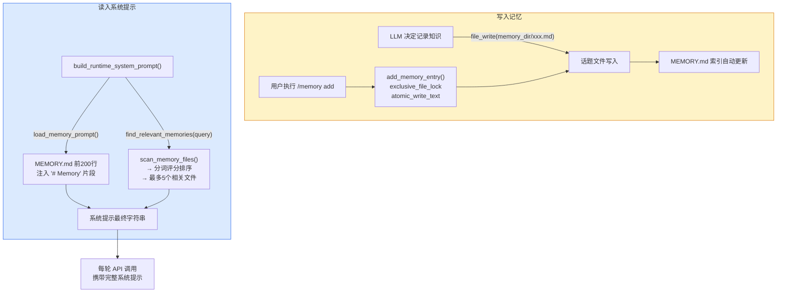

## 为什么需要记忆系统

LLM 对话是无状态的——每次会话结束，对话历史就消失了。记忆系统解决这个问题：把 LLM 学到的项目知识（架构约定、已知 bug、团队习惯）**持久化到文件**，下次会话时重新注入上下文。

---

## 存储位置

> **文件**: `src/openharness/memory/paths.py`

每个项目都有独立的记忆目录，通过 **项目路径的 SHA-1（前 12 位）** 做隔离：

```python
def get_project_memory_dir(cwd: str | Path) -> Path:
    path = Path(cwd).resolve()
    digest = sha1(str(path).encode("utf-8")).hexdigest()[:12]
    memory_dir = get_data_dir() / "memory" / f"{path.name}-{digest}"
    memory_dir.mkdir(parents=True, exist_ok=True)
    return memory_dir
```

实际路径示例：
```
~/.openharness/data/memory/my-app-a3f9c812de04/
├── MEMORY.md          ← 索引文件（目录）
├── architecture.md    ← 话题文件
├── database_schema.md
└── known_issues.md
```

<Info>
不同路径下的同名项目（如 `/work/my-app` 和 `/home/my-app`）会有不同的 SHA-1 digest，记忆完全隔离。
</Info>

---

## 文件结构

### MEMORY.md（索引）

由系统自动维护的索引文件，记录所有话题文件的链接：

```markdown
# Memory Index
- [Architecture Overview](architecture.md)
- [Database Schema Notes](database_schema.md)
- [Known Issues](known_issues.md)
```

### 话题文件（Topic Files）

每个记忆条目是一个独立的 `.md` 文件，建议带 YAML frontmatter：

```markdown
---
name: database-schema
description: Multi-tenant schema conventions
type: architecture
---

The users table has a composite key (tenant_id, user_id).
Always filter by tenant_id first for index efficiency.
JOIN order matters for query planner.
```

文件名由标题 slug 化生成：`"Database Schema Notes"` → `database_schema_notes.md`（`re.sub(r"[^a-zA-Z0-9]+", "_", title.lower())`）。

---

## 写入机制：LLM 如何"记住"东西

记忆系统的写入有两个路径：

### 路径一：LLM 通过文件工具直接写

系统提示里（`load_memory_prompt()`）会告诉 LLM 记忆目录的路径：

```
# Memory
- Persistent memory directory: /home/user/.openharness/data/memory/my-app-a3f9c812/
- Use this directory to store durable user or project context that should survive future sessions.
- Prefer concise topic files plus an index entry in MEMORY.md.
```

LLM 看到这段指令后，直接用 `file_write` 或 `file_edit` 工具在这个目录里创建/编辑文件。**记忆写入完全复用普通文件工具**，不需要特殊的记忆工具。

### 路径二：用户通过 `/memory` 命令操作

> **文件**: `src/openharness/commands/registry.py`

```bash
/memory list                          # 列出所有记忆文件
/memory show architecture             # 查看某个记忆文件
/memory add "DB Rules" :: 内容...     # 通过结构化 API 添加
/memory remove known_issues           # 删除记忆条目
```

`/memory add` 内部调用 `add_memory_entry()`：

```python
def add_memory_entry(cwd, title, content) -> Path:
    memory_dir = get_project_memory_dir(cwd)
    slug = sub(r"[^a-zA-Z0-9]+", "_", title.strip().lower()).strip("_") or "memory"
    path = memory_dir / f"{slug}.md"

    with exclusive_file_lock(_memory_lock_path(cwd)):   # ← 文件锁防并发冲突
        atomic_write_text(path, content.strip() + "\n") # ← 原子写入

        # 自动更新 MEMORY.md 索引
        existing = entrypoint.read_text() if entrypoint.exists() else "# Memory Index\n"
        if path.name not in existing:
            existing = existing.rstrip() + f"\n- [{title}]({path.name})\n"
            atomic_write_text(entrypoint, existing)
    return path
```

---

## 注入系统提示

### 固定层：MEMORY.md 全文

`load_memory_prompt()` 读取 MEMORY.md 前 `max_entrypoint_lines`（默认 200）行，直接注入系统提示：

```python
def load_memory_prompt(cwd, *, max_entrypoint_lines: int = 200) -> str | None:
    lines = [
        "# Memory",
        f"- Persistent memory directory: {memory_dir}",
        "- Use this directory to store durable ...",
    ]
    if entrypoint.exists():
        content_lines = entrypoint.read_text().splitlines()[:max_entrypoint_lines]
        lines.extend(["", "## MEMORY.md", "```md", *content_lines, "```"])
    return "\n".join(lines)
```

### 动态层：相关性检索（Relevant Memories）

除了固定加载 MEMORY.md，系统还会针对**本次用户提问**检索相关记忆文件，把内容也注入系统提示（每个文件截断至 8000 字符）。

---

## 相关性检索算法

> **文件**: `src/openharness/memory/search.py` + `scan.py`

### 第一步：扫描所有记忆文件

`scan_memory_files()` 读取记忆目录下所有 `*.md`（除 MEMORY.md），提取元数据：

```python
def _parse_memory_file(path, content) -> MemoryHeader:
    # 1. 解析 YAML frontmatter（手动行解析）
    #    提取 name / description / type 字段
    # 2. Fallback：第一个非空、非标题行作为 description
    # 3. 构建 body_preview（正文前 300 字符，排除已用作描述的行）
    return MemoryHeader(
        title=...,
        description=...,
        body_preview=...,
        modified_at=path.stat().st_mtime,
    )
```

### 第二步：对查询分词

```python
def _tokenize(text: str) -> set[str]:
    # ASCII 词（≥3 字符）
    ascii_tokens = {t for t in re.findall(r"[A-Za-z0-9_]+", text.lower()) if len(t) >= 3}
    # 汉字（每个字符独立有意义）
    han_chars = set(re.findall(r"[\u4e00-\u9fff\u3400-\u4dbf]", text))
    return ascii_tokens | han_chars
```

查询 `"database schema tenant"` → tokens: `{"database", "schema", "tenant"}`  
查询 `"数据库多租户"` → tokens: `{"数", "据", "库", "多", "租", "户"}`

### 第三步：计算得分并排序

```python
def find_relevant_memories(query, cwd, *, max_results=5) -> list[MemoryHeader]:
    tokens = _tokenize(query)
    scored = []
    for header in scan_memory_files(cwd, max_files=100):
        meta = f"{header.title} {header.description}".lower()
        body = header.body_preview.lower()

        meta_hits = sum(1 for t in tokens if t in meta)   # metadata 命中次数
        body_hits = sum(1 for t in tokens if t in body)    # body 命中次数
        score = meta_hits * 2.0 + body_hits                # metadata 权重 2x

        if score > 0:
            scored.append((score, header))

    # 主排序：得分降序；次排序：最近修改优先
    scored.sort(key=lambda item: (-item[0], -item[1].modified_at))
    return [header for _, header in scored[:max_results]]
```

**评分逻辑**：标题/描述中的关键词命中权重是正文的 **2 倍**。这激励用户在记忆文件里写好 frontmatter。

---

## 完整数据流图



---

## 记忆文件格式规范

推荐的记忆文件格式（利于 `find_relevant_memories` 精准检索）：

```markdown
---
name: database-conventions
description: PostgreSQL multi-tenant query rules and index strategy
type: architecture
---

## Key Rules

- Always filter by `tenant_id` first (composite index prefix)
- Use `SELECT ... FOR UPDATE SKIP LOCKED` for job queues
- Avoid `LIKE '%...'` on unindexed columns

## Schema

users: (tenant_id, user_id) PK, indexed by email per tenant
```

**YAML 字段说明**：

| 字段 | 用途 | 不填的后果 |
|------|------|-----------|
| `name` | 显示名称 | 用文件名（slug 格式）代替 |
| `description` | 搜索时权重 2x | Fallback 到第一个非空行 |
| `type` | 分类标签（目前仅供参考） | 不影响检索 |

---

## /memory 命令参考

```bash
/memory                              # 显示记忆目录路径
/memory list                         # 列出所有 *.md 文件名
/memory show <name>                  # 输出某文件全文
/memory add <title> :: <content>     # 创建话题文件并更新索引
/memory remove <name>                # 删除文件并从索引移除
```

---

## 关键代码位置速查

| 功能 | 文件 |
|------|------|
| 存储路径计算（SHA-1 隔离）| `src/openharness/memory/paths.py` |
| CRUD 操作（add/remove/list）| `src/openharness/memory/manager.py` |
| 注入系统提示 | `src/openharness/memory/memdir.py` |
| 扫描 + 解析记忆文件 | `src/openharness/memory/scan.py` |
| 相关性检索算法 | `src/openharness/memory/search.py` |
| 数据模型 `MemoryHeader` | `src/openharness/memory/types.py` |
| `/memory` 命令注册 | `src/openharness/commands/registry.py` |
