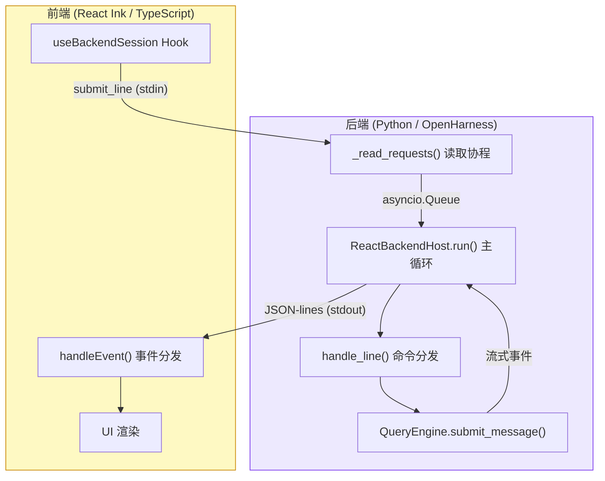
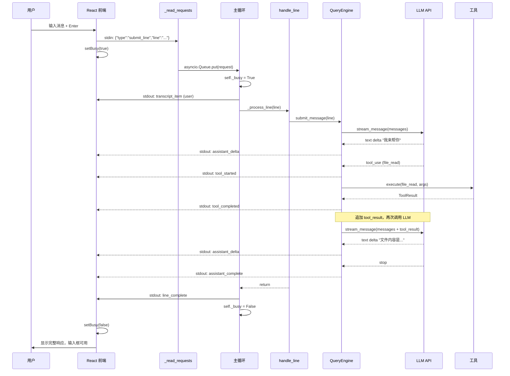

## 概述

当用户在 TUI 中输入一条消息并按下 Enter，背后经历了一个完整的 **前端 → 后端 → LLM → 工具执行 → 流式响应 → 前端渲染** 的闭环流程。

本文将一步步拆解这个消息循环，展示请求如何在前后端之间流转，以及流式事件如何驱动实时 UI 更新。

---

## 高层架构



---

## 详细流程：一个完整的消息周期

### 第一步：前端发送请求

用户在输入框输入文本并按 Enter：

```typescript
const handleSubmit = (value: string) => {
    // 普通消息 → 发送 submit_line 请求
    session.sendRequest({
        type: 'submit_line',
        line: value  // 例如 "告诉我 test.txt 的内容"
    });
    session.setBusy(true);
    setInput('');
};
```

请求以 JSON-lines 格式写入后端进程的 stdin：
```json
{"type":"submit_line","line":"告诉我 test.txt 的内容"}
```

---

### 第二步：后端读取请求

`_read_requests()` 作为独立的异步任务持续运行，通过 `asyncio.to_thread()` 在线程中读取阻塞的 stdin：

```python
async def _read_requests(self) -> None:
    while True:
        # 在线程中阻塞读取 stdin
        raw = await asyncio.to_thread(sys.stdin.buffer.readline)
        
        if not raw:  # EOF
            await self._request_queue.put(FrontendRequest(type="shutdown"))
            return
        
        request = FrontendRequest.model_validate_json(raw.decode("utf-8").strip())
        
        # 权限响应通过 Future 直接传递，不经过队列
        if request.type == "permission_response":
            future = self._permission_requests[request.request_id]
            future.set_result(bool(request.allowed))
            continue
        
        # 其他请求放入队列
        await self._request_queue.put(request)
```

<Info>
**为什么权限响应不走队列？** 权限请求发生在工具执行过程中，工具正在 `await` 等待结果。通过 `Future` 直接传递，可以立即唤醒等待中的工具执行逻辑，无需等待队列消费。
</Info>

---

### 第三步：主循环分发请求

主循环从 `asyncio.Queue` 中取出请求并分发处理：

```python
while self._running:
    request = await self._request_queue.get()
    
    if request.type == "shutdown":
        break
    elif request.type == "submit_line":
        if self._busy:
            await self._emit(BackendEvent(type="error", message="Session is busy"))
            continue
        
        self._busy = True
        try:
            should_continue = await self._process_line(request.line or "")
        finally:
            self._busy = False
```

`self._busy` 标志确保同一时刻只有一个请求在处理，防止并发写入消息历史。

---

### 第四步：处理行 (_process_line)

`_process_line` 是单次请求处理的入口：

```python
async def _process_line(self, line: str) -> bool:
    # 1. 发送用户消息转录项（前端显示用户消息）
    await self._emit(BackendEvent(type="transcript_item", 
                                  item=TranscriptItem(role="user", text=line)))
    
    # 2. 调用 handle_line 处理
    should_continue = await handle_line(
        self._bundle, line,
        render_event=_render_event,  # 事件流回调
    )
    
    # 3. 发送完成事件
    await self._emit(BackendEvent(type="line_complete"))
    return should_continue
```

---

### 第五步：handle_line — 命令 vs AI

`handle_line` 是命令与 AI 消息的分发点：

```python
async def handle_line(bundle, line, ...) -> bool:
    # 尝试匹配命令（如 /plan, /clear）
    parsed = bundle.commands.lookup(line)
    
    if parsed is not None:
        # 命令处理
        command, args = parsed
        result = await command.handler(args, CommandContext(...))
        # 某些命令会产生 submit_prompt，继续提交给 AI
        if result.submit_prompt is not None:
            async for event in bundle.engine.submit_message(result.submit_prompt):
                await render_event(event)
        return True
    
    # 普通消息 → 提交给 QueryEngine
    async for event in bundle.engine.submit_message(line):
        await render_event(event)
    return True
```

---

### 第六步：QueryEngine 流式处理

`submit_message()` 是 Agent 核心循环——它会驱动 LLM 调用和工具执行的多轮循环，以 async generator 流式产出事件：

```
engine.submit_message(line)
    ↓
调用 LLM (stream)
    ↓
流式产出事件
    ├─ AssistantTextDelta ("我来帮你")
    ├─ ToolExecutionStarted (tool_name: "file_read")
    ├─ ToolExecutionCompleted (output: "Hello World")
    ├─ AssistantTextDelta ("文件内容是...")
    └─ AssistantTurnComplete
```

如果 LLM 返回了 `tool_use`，引擎会自动执行工具、将结果追加到消息历史、再次调用 LLM，直到没有新的工具调用为止。

---

### 第七步：事件发送到前端

每个流式事件通过 `_emit()` 立即写入 stdout：

```python
async def _emit(self, event: BackendEvent) -> None:
    async with self._write_lock:  # 保护并发写入
        json_str = event.model_dump_json(exclude_none=True)
        sys.stdout.buffer.write(json_str.encode("utf-8"))
        sys.stdout.buffer.write(b"\n")
        sys.stdout.buffer.flush()  # 立即发送
```

`render_event` 回调将引擎事件转换为后端事件：

```python
async def _render_event(event: StreamEvent) -> None:
    if isinstance(event, AssistantTextDelta):
        await self._emit(BackendEvent(type="assistant_delta", message=event.text))
    
    if isinstance(event, ToolExecutionStarted):
        await self._emit(BackendEvent(type="tool_started", 
                                     tool_name=event.tool_name))
    
    if isinstance(event, ToolExecutionCompleted):
        await self._emit(BackendEvent(type="tool_completed",
                                     tool_name=event.tool_name,
                                     output=event.output))
    
    if isinstance(event, AssistantTurnComplete):
        await self._emit(BackendEvent(type="assistant_complete"))
```

---

### 第八步：前端接收与渲染

前端通过 `useBackendSession` Hook 在 stdout 上逐行读取事件并分发处理：

```typescript
const handleEvent = (event: BackendEvent): void => {
    if (event.type === 'transcript_item') {
        queueTranscriptItem(event.item);  // 显示用户消息
    }
    
    if (event.type === 'assistant_delta') {
        // 流式文本：防抖 + 累积后批量刷新
        pendingAssistantDeltaRef.current += event.message;
    }
    
    if (event.type === 'tool_started') {
        // 显示 "Running file_read..."
    }
    
    if (event.type === 'tool_completed') {
        // 显示工具执行结果
    }
    
    if (event.type === 'line_complete') {
        setBusy(false);  // 清除加载状态，允许新输入
    }
};
```

<Tip>
前端对 `assistant_delta` 事件做了防抖优化——累积到 50 字符或超过 100ms 后才刷新一次渲染，平衡了响应性和渲染性能。
</Tip>

---

## 时间线示例

一次完整交互的事件时间线：

| 时间 | 后端 | 前端 |
|------|------|------|
| T0 | 接收 `submit_line` 请求 | 显示输入，设置忙碌 |
| T1 | 发送 `transcript_item` (user) | 显示用户消息 |
| T2 | 提交给 QueryEngine | 显示加载旋转 |
| T3-T4 | 发送 `assistant_delta` | 缓冲 + 防抖 |
| T5 | — | 批量刷新文本 |
| T6 | 发送 `tool_started` (file_read) | 显示 "Running file_read..." |
| T7 | 执行工具 | 等待中... |
| T8 | 发送 `tool_completed` | 显示工具结果 |
| T9 | 发送 `assistant_delta` | 缓冲 |
| T10 | 发送 `assistant_complete` | 完成此轮 |
| T11 | 发送 `line_complete` | 清除忙碌，允许输入 |

---

## 关键架构特性

| 特性 | 实现方式 | 目的 |
|------|----------|------|
| **读写分离** | 独立 `_read_requests()` 协程 + `asyncio.Queue` | stdin 阻塞读取不影响主循环 |
| **流式输出** | 每个事件立即 `emit` + `flush` | 最小延迟，实时反馈 |
| **并发保护** | `self._busy` 标志 + `_write_lock` | 防止竞态条件 |
| **防抖优化** | 100ms 防抖 + 50 字符阈值 | 平衡响应性和渲染性能 |
| **错误隔离** | `try-finally` 保证清理 `_busy` 标志 | 即使出错也能恢复可用 |
| **权限直通** | Future 绕过队列 | 工具执行不被队列阻塞 |

---

## 完整消息循环流程图


