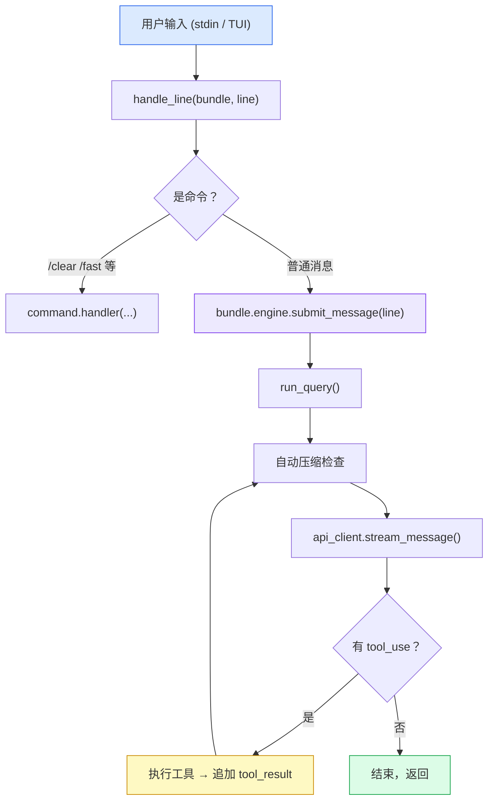
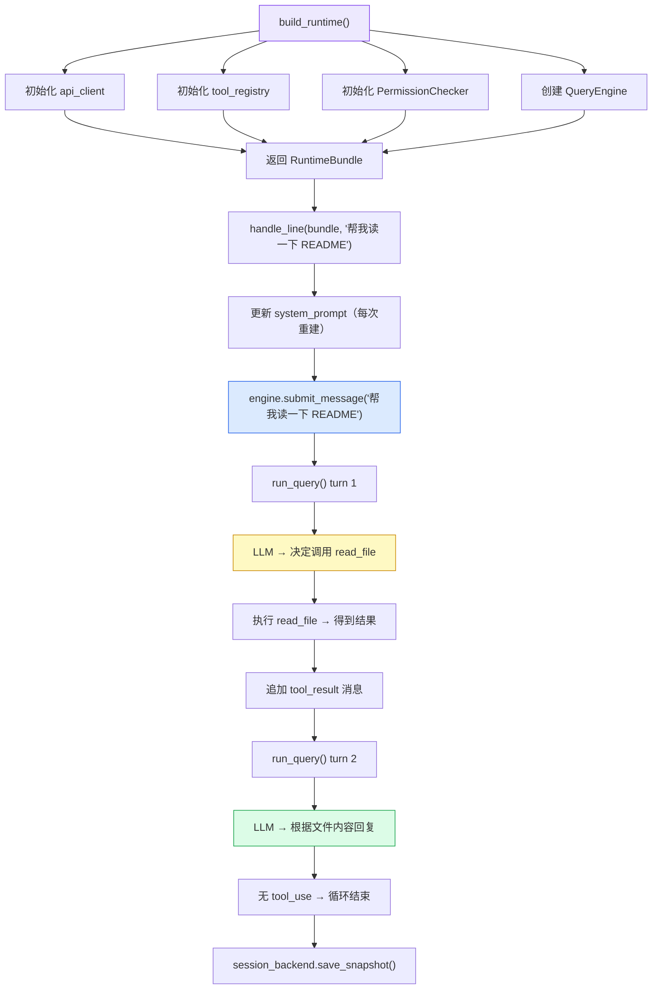

## 一句话总结

- **`RuntimeBundle`** — Session 的"配件盒"，持有所有运行时资源（API client、工具注册表、权限检查器等）
- **`QueryEngine`** — 消息循环的"驾驶员"，持有对话历史，驱动 `model → tool` 的多轮循环
- **`handle_line()`** — 连接两者的桥梁，把用户输入路由到 QueryEngine

---

## 层次结构



---

## RuntimeBundle：运行时容器

> **文件**: `src/openharness/ui/runtime.py`

`build_runtime()` 在 Session 开始时一次性组装，返回 `RuntimeBundle`。它本身**不驱动任何循环**，只是把依赖打包到一起：

| 字段 | 作用 |
|------|------|
| `api_client` | 与 LLM 通信（Anthropic / OpenAI / Copilot） |
| `tool_registry` | 所有可用工具的注册表（内置 + MCP + Plugin） |
| `engine` | QueryEngine 实例（持有对话历史） |
| `app_state` | UI 状态（当前 model、permission mode 等） |
| `hook_executor` | 生命周期钩子（SESSION_START、STOP 等） |
| `mcp_manager` | MCP 服务连接管理器 |
| `commands` | slash command 注册表 |
| `session_backend` | 会话快照持久化 |
| `settings_overrides` | CLI 传入的覆盖参数 |

<Info>
**为什么要有 `settings_overrides`？**
CLI 传入的参数（`--model`、`--api-format`）不应被 `/fast` 等命令刷新 settings 后覆盖。`current_settings()` 每次从磁盘 load 后 merge CLI 覆盖，保证 CLI 参数优先。
</Info>

---

## QueryEngine：对话管理器

> **文件**: `src/openharness/engine/query_engine.py`

QueryEngine 是**有状态的对话管理器**，核心职责包括：

### 1. 持有对话历史

```python
self._messages: list[ConversationMessage]
```

每一轮 user → assistant → tool_result 的消息都追加在这里。

### 2. 驱动 model → tool 多轮循环

`submit_message()` 内部调用 `run_query()`，这是真正的循环核心：

```
while turn_count < max_turns:
    1. 检查是否需要自动压缩 (auto-compact)
    2. 调用 api_client.stream_message() → 流式输出 AssistantTextDelta
    3. 收到 ApiMessageCompleteEvent    → yield AssistantTurnComplete
    4. final_message 有 tool_use?
       - 有 → 执行工具 → 追加 tool_result → continue（下一轮）
       - 无 → return（结束）
```

`max_turns` 默认 8，超过抛出 `MaxTurnsExceeded`。

### 3. 追踪 tool_metadata（跨轮次状态）

每次工具执行完毕，`_record_tool_carryover()` 记录状态信息：

| 记录内容 | 说明 |
|----------|------|
| `read_file_state` | 最近读过哪些文件 |
| `recent_work_log` | 最近的操作日志 |
| `task_focus_state` | 当前目标、已验证工作 |
| `invoked_skills` | 用过哪些 skill |
| `async_agent_tasks` | 派生的异步 agent 任务 |

这些信息在下一次 `handle_line()` 时被注入 system prompt，让 LLM "记得"上一轮做过什么。

### 4. 权限检查

调用工具前，`PermissionChecker` 检查是否允许。不允许时根据配置弹出确认提示或直接拒绝。

---

## 两者如何配合：完整流程



---

## System Prompt 的动态构建

每次用户提交输入，`handle_line()` 都会调用 `build_runtime_system_prompt()` **重新组装** system prompt。它由多个 section 拼接而成：

| 顺序 | Section | 说明 |
|------|---------|------|
| 1 | 基础人设 + 环境 | "You are OpenHarness..." + OS / Shell / cwd / Date / Git branch |
| 2 | Session 模式 | fast_mode → "prefer concise replies..." |
| 3 | Reasoning 配置 | effort / passes 设置 |
| 4 | 可用 Skills | 已加载的 skill 名称和描述 |
| 5 | 子 Agent 委托说明 | 如何派发 sub-agent |
| 6 | 项目约定 | CLAUDE.md / .oh/instructions.md 等文件内容 |
| 7 | 本地环境规则 | personalization 加载 |
| 8 | Issue / PR 上下文 | .oh/issue.md / .oh/pr_comments.md |
| 9 | Memory | 全局记忆 + 与当前输入相关的记忆 |

<Note>
**为什么每次都重建？**
- `latest_user_prompt` 用于 `find_relevant_memories()` 做语义搜索
- Date、cwd、skills 可能在 session 中变化（`/cd` 命令）
- tool_metadata（已读文件、工作日志）每轮都不同
</Note>

---

## Messages 列表的生命周期

对话历史的每一次 append 都有明确的时机和角色：

### 三次关键 append

| 步骤 | 发生位置 | role | content |
|------|----------|------|---------|
| **[1]** | `submit_message()` | `"user"` | 用户输入文本 |
| **[2]** | `run_query()` 每轮末 | `"assistant"` | LLM 完整回复（文字 + tool_use 声明） |
| **[3]** | `run_query()` 工具执行后 | `"user"` | 工具结果（`ToolResultBlock` 列表） |

<Warning>
步骤 [3] 的 role 是 `"user"` 而不是 `"tool"`——这是 Anthropic API 的约定。工具结果以 user message 身份追加。
</Warning>

### self._messages 的同步时机

`submit_message()` 传给 `run_query()` 的是 `query_messages`（浅拷贝），`self._messages` 只在 **每次 LLM 完整回复后** 同步：

```python
async for event, usage in run_query(context, query_messages):
    if isinstance(event, AssistantTurnComplete):
        self._messages = list(query_messages)  # ← 同步点
```

若 `run_query()` 中途报错，`self._messages` 保留到上一次成功的 assistant turn 为止，保证数据一致性。

---

## 工具执行生命周期

`_execute_tool_call` 是单次工具执行的完整流程：

<Steps>
  <Step title="PRE_TOOL_USE Hook">
    执行前置钩子，若 `blocked` 则直接返回错误
  </Step>
  <Step title="工具查找">
    从 `tool_registry` 获取工具实例，未找到返回 "Unknown tool"
  </Step>
  <Step title="输入校验">
    用 Pydantic model 校验输入参数
  </Step>
  <Step title="路径 & 命令标准化">
    提取 `file_path` 和 `command`，相对路径转绝对路径
  </Step>
  <Step title="权限检查">
    调用 `PermissionChecker.evaluate()`，根据决策矩阵处理
  </Step>
  <Step title="实际执行">
    调用 `tool.execute(parsed_input, context)`
  </Step>
  <Step title="封装结果">
    包装为 `ToolResultBlock`（含 `tool_use_id` 用于 LLM 对齐）
  </Step>
  <Step title="记录 Carryover">
    更新 `tool_metadata`（已读文件、工作日志等）
  </Step>
  <Step title="POST_TOOL_USE Hook">
    执行后置钩子
  </Step>
</Steps>

### 权限检查决策矩阵

| allowed | requires_confirmation | permission_prompt 存在 | 结果 |
|---------|----------------------|----------------------|------|
| ✅ | — | — | 继续执行 |
| ❌ | ✅ | ✅ | 弹出确认，用户决定 |
| ❌ | ✅ | ❌ | 直接拒绝（无 UI 时） |
| ❌ | ❌ | — | 直接拒绝 |

### 错误处理原则

所有错误都返回 `ToolResultBlock(is_error=True)`，**不抛异常**。这样 `run_query()` 中 `asyncio.gather(return_exceptions=True)` 收到的是正常结果，不会导致并发执行的其他工具被取消。

---

## `continue_pending()` vs `submit_message()`

| | `submit_message()` | `continue_pending()` |
|---|---|---|
| 使用场景 | 普通用户输入 | 上次因 max_turns 中断，tool_result 未被回复 |
| 是否追加新 user message | ✅ | ❌ |
| 对应 slash command | 无 | `/continue` |

---

## 工具注册与 BaseTool 接口

> **文件**: `src/openharness/tools/base.py`

### ToolRegistry

```python
class ToolRegistry:
    _tools: dict[str, BaseTool]

    def register(tool: BaseTool)        # 按 tool.name 注册
    def get(name: str) -> BaseTool | None
    def list_tools() -> list[BaseTool]
    def to_api_schema() -> list[dict]   # 转成 LLM API 格式
```

### BaseTool 接口

```python
class BaseTool(ABC):
    name: str                        # 工具唯一标识
    description: str                 # 注入 LLM 的描述
    input_model: type[BaseModel]     # Pydantic 输入校验模型

    async def execute(arguments, context) -> ToolResult
    def is_read_only(arguments) -> bool   # 默认 False
    def to_api_schema() -> dict
```

### 注册流程

```
build_runtime()
    └─ create_default_tool_registry(mcp_manager)
        ├─ 逐个 register() 38+ 个内置工具
        ├─ 动态 register() MCP 工具（McpToolAdapter）
        └─ 再 register() 插件工具
```

---

## 关键代码位置速查

| 功能 | 文件 |
|------|------|
| RuntimeBundle 定义与组装 | `src/openharness/ui/runtime.py` |
| QueryEngine 核心 | `src/openharness/engine/query_engine.py` |
| run_query 循环 | `src/openharness/engine/query.py` |
| handle_line 分发 | `src/openharness/ui/runtime.py` |
| system_prompt 组装 | `src/openharness/prompts/context.py` |
| BaseTool 与 ToolRegistry | `src/openharness/tools/base.py` |
| 权限检查 | `src/openharness/permissions/` |
