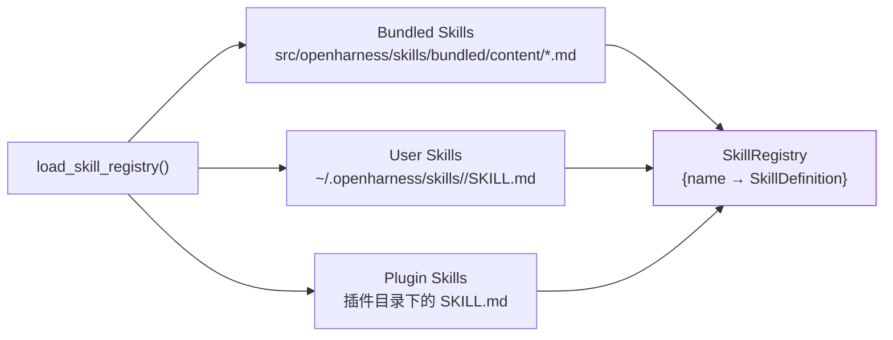
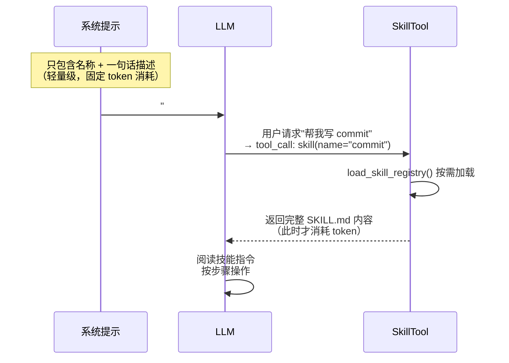
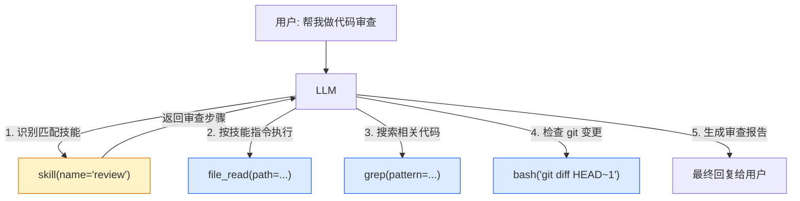
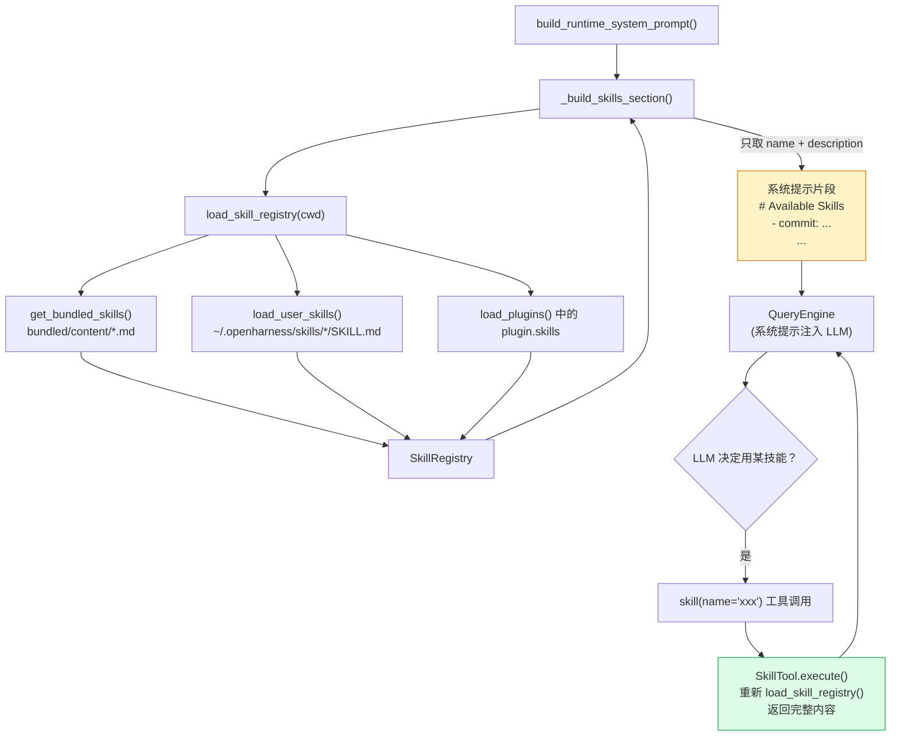

## 概述：Skill vs Tool 的根本区别

在 OpenHarness 里，**Skill（技能）** 和 **Tool（工具）** 是两种完全不同的概念：

| | Tool | Skill |
|---|---|---|
| **本质** | 可执行能力（代码） | 指令集/知识（Markdown） |
| **LLM 如何使用** | 通过 `tool_use` 调用，引擎执行 | 通过 `skill` 工具读取，LLM 自己遵循 |
| **定义方式** | Python 类继承 `BaseTool` | SKILL.md 文件 |
| **示例** | `bash`、`file_edit`、`grep` | `commit`、`debug`、`plan`、`review` |
| **执行者** | Python 运行时 | LLM 自身 |

简单说：**Tool 赋予 LLM 做事的能力，Skill 赋予 LLM 做事的方法**。

---

## Skill 的数据模型

> **文件**: `src/openharness/skills/types.py`

```python
@dataclass(frozen=True)
class SkillDefinition:
    name: str         # 技能名称（LLM 用这个调用）
    description: str  # 一句话描述（写入系统提示）
    content: str      # 完整 SKILL.md 内容（按需加载给 LLM）
    source: str       # "bundled" | "user" | "plugin"
    path: str | None  # 文件路径
```

---

## Skill 的三大来源



### 1. 内置技能（Bundled）

存放于 `src/openharness/skills/bundled/content/`，随包发布：

| 文件名 | 技能名 | 用途 |
|--------|--------|------|
| `commit.md` | commit | 生成规范的 Git commit message |
| `debug.md` | debug | 系统化调试流程 |
| `diagnose.md` | diagnose | 根因分析 |
| `plan.md` | plan | 任务拆解与规划 |
| `review.md` | review | 代码审查 |
| `simplify.md` | simplify | 代码简化 |
| `test.md` | test | 测试编写规范 |

每个文件都是标准 Markdown，带 YAML frontmatter：

```markdown
---
name: commit
description: Create a conventional Git commit message from staged changes
---

# Commit Skill

## Steps
1. Run `git diff --staged` to see staged changes
2. ...
```

### 2. 用户技能（User）

放在 `~/.openharness/skills/<技能名>/SKILL.md`，用户自定义。目录名即技能名。

### 3. 插件技能（Plugin）

插件可以携带自己的技能，加载插件时一并注册到 `SkillRegistry`。

---

## 渐进式披露：核心设计模式

这是整个 Skill 系统最重要的设计决策。

### 问题：为什么不把所有技能内容都放进系统提示？

如果把 7 个内置技能的完整 Markdown 全部塞进系统提示，会浪费大量 token——大多数对话根本不需要所有技能。

### 解决方案：两阶段加载



### 阶段一：系统提示只注入摘要

> **文件**: `src/openharness/prompts/context.py`

```python
def _build_skills_section(cwd, ...) -> str:
    registry = load_skill_registry(cwd, ...)
    skills = registry.list_skills()
    lines = [
        "# Available Skills",
        "",
        "The following skills are available via the `skill` tool. "
        "When a user's request matches a skill, invoke it with `skill(name=\"<skill_name>\")` "
        "to load detailed instructions before proceeding.",
        "",
    ]
    for skill in skills:
        lines.append(f"- **{skill.name}**: {skill.description}")
    return "\n".join(lines)
```

系统提示里实际看到的内容类似：

```
# Available Skills

The following skills are available via the `skill` tool. When a user's request
matches a skill, invoke it with `skill(name="<skill_name>")` to load detailed
instructions before proceeding.

- **commit**: Create a conventional Git commit message from staged changes
- **debug**: Systematic debugging workflow
- **plan**: Break down complex tasks into actionable steps
- **review**: Code review checklist and process
...
```

### 阶段二：LLM 按需调用 `skill` 工具获取完整内容

> **文件**: `src/openharness/tools/skill_tool.py`

```python
class SkillTool(BaseTool):
    name = "skill"
    description = "Read a bundled, user, or plugin skill by name."
    input_model = SkillToolInput  # {name: str}

    async def execute(self, arguments, context) -> ToolResult:
        registry = load_skill_registry(
            context.cwd,
            extra_skill_dirs=context.metadata.get("extra_skill_dirs"),
            extra_plugin_roots=context.metadata.get("extra_plugin_roots"),
        )
        skill = registry.get(arguments.name)
        if skill is None:
            return ToolResult(output=f"Skill not found: {arguments.name}", is_error=True)
        return ToolResult(output=skill.content)   # ← 返回完整 SKILL.md 内容
```

`skill` 工具本质上就是一个**按需文件读取器**：LLM 触发调用 → 读取对应 SKILL.md → 返回完整指令文本 → LLM 按指令操作。

---

## Skill 与 Tool 的协作关系

Skill 通常会**指导 LLM 如何组合使用多个 Tool**，两者形成"策略 + 执行"的协作：



**Skill 是编排层**（告诉 LLM 该做什么、按什么顺序）；**Tool 是执行层**（实际操作文件、运行命令）。

---

## tool_search：另一种渐进式披露

除了 `skill` 工具，`tool_search` 工具解决类似问题——当工具太多时，LLM 不一定记得所有工具名，可以通过搜索找到合适的工具：

> **文件**: `src/openharness/tools/tool_search_tool.py`

```python
class ToolSearchTool(BaseTool):
    name = "tool_search"
    description = "Search the available tool list by name or description."
    # 入参: {query: str}

    async def execute(self, arguments, context) -> ToolResult:
        registry = context.metadata.get("tool_registry")
        query = arguments.query.lower()
        matches = [
            tool for tool in registry.list_tools()
            if query in tool.name.lower() or query in tool.description.lower()
        ]
        return ToolResult(output="\n".join(
            f"{tool.name}: {tool.description}" for tool in matches
        ))
```

这样整个系统形成了**三层渐进式披露**：

```
第 1 层（始终在 context）：
  系统提示里的 Skill 名称列表 + 工具的 JSON Schema

第 2 层（按需加载）：
  skill(name="xxx") → 完整 SKILL.md 指令

第 3 层（辅助搜索）：
  tool_search(query="...") → 匹配的工具名+描述
```

---

## 完整加载流程



<Info>
注意 `SkillTool.execute()` 里每次都重新调用 `load_skill_registry()`，而不是缓存。这意味着用户在会话中途新增 SKILL.md 文件，下次调用 `skill` 工具就能立即生效，无需重启。
</Info>

---

## 创建自定义技能

在 `~/.openharness/skills/` 目录下新建一个子目录，添加 `SKILL.md`：

```
~/.openharness/skills/
└── my-deploy/
    └── SKILL.md
```

`SKILL.md` 格式：

```markdown
---
name: my-deploy
description: Deploy the project to production using our internal pipeline
---

# My Deploy Skill

## Prerequisites
- Check that all tests pass: `bash("pytest")`
- Confirm the target environment with the user

## Steps
1. Build the Docker image: `bash("docker build -t myapp .")`
2. ...
```

下次启动 OpenHarness（或在会话中调用 `skill(name="my-deploy")`），LLM 就会按这份指令执行部署流程。

---

## 关键代码位置速查

| 功能 | 文件 |
|------|------|
| SkillDefinition 数据模型 | `src/openharness/skills/types.py` |
| SkillRegistry | `src/openharness/skills/registry.py` |
| 加载入口 | `src/openharness/skills/loader.py` |
| 内置技能文件 | `src/openharness/skills/bundled/content/*.md` |
| 系统提示注入 | `src/openharness/prompts/context.py` (`_build_skills_section`) |
| skill 工具 | `src/openharness/tools/skill_tool.py` |
| tool_search 工具 | `src/openharness/tools/tool_search_tool.py` |
