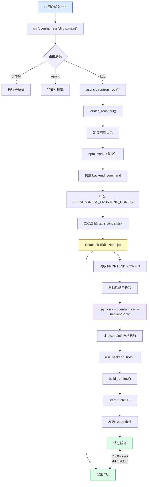

## 概述

当你在终端输入 `oh` 命令时，OpenHarness 会经历一个**双进程启动**过程：先启动一个 Node.js 的 React Ink 前端进程，前端再拉起一个 Python 后端子进程，两者通过 **JSON-lines 协议**在 stdin/stdout 上通信。

这种前后端分离的架构使得同一套 Agent 引擎可以服务于多种 UI 形态（TUI、CLI Print、API 等），而不需要修改核心逻辑。

---

## 启动链路总览

整个启动可以分为 **4 个阶段**：

<Steps>
  <Step title="CLI 路由">
    `oh` 命令通过 typer 框架解析参数，路由到 TUI 启动路径
  </Step>
  <Step title="React 前端启动">
    Python 进程通过 `tsx` 启动 React Ink 前端（Node.js 进程）
  </Step>
  <Step title="后端子进程拉起">
    React 前端读取配置，启动 `python -m openharness --backend-only` 作为后端
  </Step>
  <Step title="JSON-lines 通信建立">
    前后端通过 stdin/stdout 的 JSON-lines 协议交换消息，TUI 开始渲染
  </Step>
</Steps>

---

## 阶段 1：CLI 入口与路由

> **文件**: `src/openharness/cli.py`

`oh` 命令的入口是一个 typer 应用，通过 `invoke_without_command=True` 实现"无子命令时也执行主回调"：

```python
app = typer.Typer(
    name="openharness",
    invoke_without_command=True,  # ← 关键：直接输入 oh 也触发 main()
)

@app.callback(invoke_without_command=True)
def main(ctx: typer.Context, ...):
    """Start an interactive session or run a single prompt."""
```

`main()` 根据参数进行路由：

| 条件 | 执行路径 | 说明 |
|------|----------|------|
| `ctx.invoked_subcommand` | 子命令处理 | `oh mcp list` 等 |
| `--continue` / `--resume` | 会话恢复 | 恢复历史对话 |
| `--print "prompt"` | 非交互模式 | 单次执行，打印结果 |
| `--task-worker` | 任务工作者 | 后台任务 |
| **默认（无参数）** | **TUI 模式** ⭐ | `asyncio.run(run_repl(...))` |

绝大多数情况下，用户直接输入 `oh`，走 TUI 路径。

---

## 阶段 2：启动 React Ink 前端

> **文件**: `src/openharness/ui/react_launcher.py`

`run_repl()` 调用 `launch_react_tui()`，这是前端启动的核心函数：

### 2.1 定位前端目录

```python
frontend_dir = get_frontend_dir()
# 优先级：
# 1. openharness/_frontend/  （pip 安装的打包版本）
# 2. frontend/terminal/      （开发源码版本）
```

### 2.2 自动安装依赖（首次）

```python
if not (frontend_dir / "node_modules").exists():
    await subprocess_exec(npm, "install", "--no-fund", "--no-audit")
```

### 2.3 构建后端启动命令并注入环境变量

这是关键步骤——Python 进程把后端启动信息写入环境变量，供前端读取：

```python
env["OPENHARNESS_FRONTEND_CONFIG"] = json.dumps({
    "backend_command": build_backend_command(
        cwd=cwd,
        model=model,
        max_turns=max_turns,
        # ... 其他参数
    ),
    "initial_prompt": prompt,   # TUI 模式下为 null
    "theme": _resolve_theme(),
})
```

其中 `backend_command` 类似于：
```bash
python -m openharness --backend-only --cwd /path/to/cwd --model claude-3-5-sonnet
```

<Note>
**为什么用 `python -m openharness` 而不是 `oh`？**
为了确保使用当前 Python 解释器（`sys.executable`），在虚拟环境中正确启动后端，避免路径/环境不一致的问题。
</Note>

### 2.4 启动前端进程

```python
tsx_cmd = _resolve_tsx(frontend_dir)
process = await asyncio.create_subprocess_exec(
    *tsx_cmd, "src/index.tsx",
    cwd=str(frontend_dir),
    env=env,
)
return await process.wait()
```

- 使用 `tsx` 直接执行 TypeScript（无需编译步骤）
- 入口文件：`frontend/terminal/src/index.tsx`
- 原始 Python 进程在此阻塞等待前端退出

---

## 阶段 3：前端拉起后端子进程

> **文件**: `frontend/terminal/src/index.tsx`

React Ink 前端启动后：

1. 读取环境变量 `OPENHARNESS_FRONTEND_CONFIG`
2. 从中提取 `backend_command`
3. **启动 Python 后端子进程**
4. 建立 stdin/stdout 通信管道

后端子进程执行的是：
```bash
python -m openharness --backend-only --cwd ... --model ...
```

这会再次触发 `oh` CLI 的 `main()` 函数，但由于 `--backend-only` 标志，走的是完全不同的路径——直接进入 `run_backend_host()`。

### ReactBackendHost 启动

> **文件**: `src/openharness/ui/backend_host.py`

```python
class ReactBackendHost:
    async def run(self) -> int:
        # 1. 组装运行时（一次性）
        self._bundle = await build_runtime(
            model=model,
            max_turns=max_turns,
            system_prompt=system_prompt,
            # ...
        )
        
        # 2. 启动运行时
        await start_runtime(self._bundle)
        
        # 3. 发送 ready 事件告知前端
        await self._emit(BackendEvent.ready(...))
        
        # 4. 启动独立的 stdin 读取协程
        reader = asyncio.create_task(self._read_requests())
        
        # 5. 进入消息循环
        try:
            while self._running:
                request = await self._request_queue.get()
                if request.type == "submit_line":
                    async for event in self._bundle.engine.submit_message(text):
                        stdout_write(json.dumps(event))
        finally:
            reader.cancel()
```

<Info>
**为什么需要独立的 reader 协程？**

`sys.stdin.buffer.readline()` 是阻塞调用。如果放在主循环里，处理请求时就无法及时响应新的输入或 interrupt 信号。因此 `_read_requests()` 作为独立 Task 通过 `asyncio.to_thread()` 在线程中读取 stdin，再把请求放入 `asyncio.Queue`，主循环从 Queue 消费——实现了 **读取与处理的解耦**。
</Info>

`build_runtime()` 组装的 `RuntimeBundle` 包含了 Agent 运行所需的全部组件：
- `QueryEngine` — Agent 核心对话引擎
- `ToolRegistry` — 可用工具注册表（内置 + MCP + Plugin）
- `PermissionChecker` — 权限检查器
- `HookExecutor` — 钩子系统
- `McpClientManager` — MCP 服务器连接

---

## 前后端通信协议 (JSON-lines)

前后端通过 stdin/stdout 上的 **JSON-lines** 格式通信——每行一个完整 JSON 对象，用换行符分隔。

### 前端 → 后端（请求）

| type | 说明 | 示例 |
|------|------|------|
| `user_message` | 用户输入 | `{"type": "user_message", "text": "帮我写一个 hello world"}` |
| `permission_response` | 权限确认 | `{"type": "permission_response", "request_id": "...", "granted": true}` |
| `question_response` | 问题回答 | `{"type": "question_response", "request_id": "...", "text": "Yes"}` |

### 后端 → 前端（事件流）

| type | 说明 | 触发时机 |
|------|------|----------|
| `assistant_text_delta` | AI 流式文本 | LLM 逐 token 输出 |
| `tool_execution_started` | 工具开始执行 | QueryEngine 调用工具前 |
| `tool_execution_completed` | 工具执行完成 | 工具返回结果后 |
| `permission_request` | 请求用户授权 | 敏感操作需确认 |
| `assistant_turn_complete` | 本轮回复结束 | LLM 停止输出 |
| `status_event` | 状态提示 | 加载、处理等 |

**一次典型交互的事件序列：**

```
前端 → {"type": "user_message", "text": "读取 README.md"}
后端 → {"type": "assistant_text_delta", "text": "我来"}
后端 → {"type": "assistant_text_delta", "text": "读取"}
后端 → {"type": "assistant_text_delta", "text": "一下"}
后端 → {"type": "tool_execution_started", "tool_name": "file_read"}
后端 → {"type": "tool_execution_completed", "tool_name": "file_read", "result": "..."}
后端 → {"type": "assistant_text_delta", "text": "文件内容如下..."}
后端 → {"type": "assistant_turn_complete"}
```

---

## 完整启动流程图



**文本版流程图（详细调用栈）：**

```
user input: oh
    ↓
src/openharness/cli.py::main()
    ├─ 解析命令行参数
    ├─ 路由决策（子命令/打印/后端/TUI）
    └─ [TUI 路径] asyncio.run(run_repl(...))
        ↓
    src/openharness/ui/app.py::run_repl()
        ├─ 检查 backend_only 标志
        └─ [TUI 模式] await launch_react_tui(...)
            ↓
        src/openharness/ui/react_launcher.py::launch_react_tui()
            ├─ 定位前端 (frontend/terminal/)
            ├─ npm install (首次)
            ├─ 构建后端启动命令
            │  └─ python -m openharness --backend-only ...
            ├─ 写入环境变量 OPENHARNESS_FRONTEND_CONFIG
            └─ 启动进程: tsx src/index.tsx
                ↓
        React Ink 前端进程 (Node.js)
            ├─ 读取 OPENHARNESS_FRONTEND_CONFIG
            ├─ 启动后端子进程
            │  └─ python -m openharness --backend-only ...
            └─ 建立 JSON-lines 通信
                ↓
        Python 后端进程
            ├─ cli.py::main() 再次执行，带 --backend-only
            │  └─ await run_backend_host(...)
            └─ ReactBackendHost
                ├─ build_runtime()
                │  ├─ 加载配置和认证
                │  ├─ 初始化 ToolRegistry
                │  ├─ 加载 MCP, Hooks, Plugins, Skills
                │  └─ 创建 QueryEngine
                ├─ start_runtime()
                └─ 消息循环
                   ├─ 读取前端请求 (stdin)
                   ├─ 调用 QueryEngine
                   └─ 流式发送事件 (stdout)

与此同时，前端：
    ├─ 监听后端事件流
    ├─ 渲染 UI
    │  ├─ 用户输入框
    │  ├─ AI 响应流
    │  ├─ 工具执行进度
    │  └─ 消息历史
    └─ 处理用户交互
       └─ 发送请求到后端
```

---

## 启动时间分析

| 阶段 | 耗时 | 说明 |
|------|------|------|
| CLI 解析 | < 100ms | typer 参数解析 |
| 前端定位 | < 50ms | 查找 frontend/terminal/ |
| npm install | 10-30s | **仅首次运行** |
| 前端启动 | 1-2s | tsx 启动 React 进程 |
| RuntimeBundle 构建 | 2-5s | 加载配置、工具、MCP 等 |
| TUI 首次渲染 | ~500ms | Ink 渲染 |
| **正常启动总计** | **~3-7s** | 首次约 20-35s |

---

## 关键设计决策

<AccordionGroup>
  <Accordion title="为什么要双进程架构？">
    前后端分离使得 Agent 核心逻辑（Python）与 UI 渲染（React Ink / TypeScript）各自使用最擅长的技术栈。Python 擅长 AI/ML 生态集成，React Ink 提供丰富的终端 UI 能力。JSON-lines 协议简单可靠，也方便调试。
  </Accordion>
  <Accordion title="为什么前端用 tsx 直接执行而不编译？">
    `tsx` 允许直接执行 TypeScript 文件，省去编译步骤，简化开发和部署流程。在终端 TUI 场景下，启动速度的差异可以忽略不计。
  </Accordion>
  <Accordion title="环境变量传递配置 vs 命令行参数？">
    使用 `OPENHARNESS_FRONTEND_CONFIG` 环境变量而非命令行参数，可以传递结构化的 JSON 配置（包括嵌套对象），且不受命令行长度限制。
  </Accordion>
</AccordionGroup>

---

## 关键代码位置速查

| 功能 | 文件 | 说明 |
|------|------|------|
| CLI 入口 | `src/openharness/cli.py` | typer 应用与 main() 回调 |
| TUI 启动 | `src/openharness/ui/app.py` | run_repl() 函数 |
| React 前端启动器 | `src/openharness/ui/react_launcher.py` | launch_react_tui() |
| 后端 Host | `src/openharness/ui/backend_host.py` | ReactBackendHost |
| 运行时构建 | `src/openharness/ui/runtime.py` | build_runtime() / RuntimeBundle |
| QueryEngine | `src/openharness/engine/query_engine.py` | Agent 核心对话引擎 |
