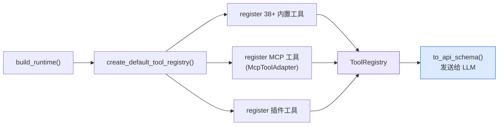
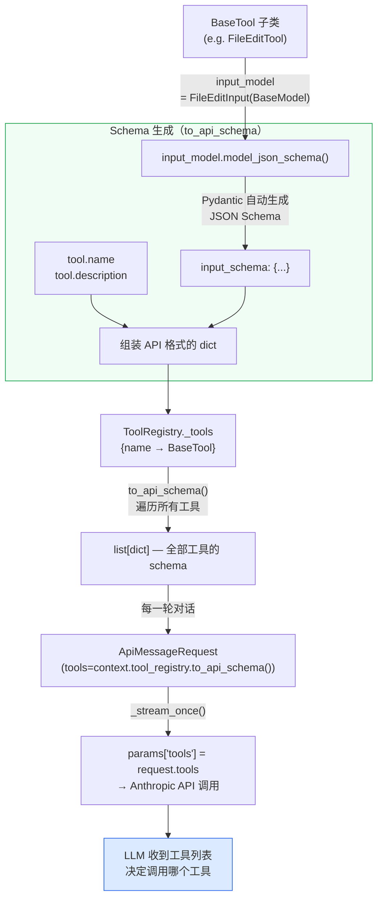
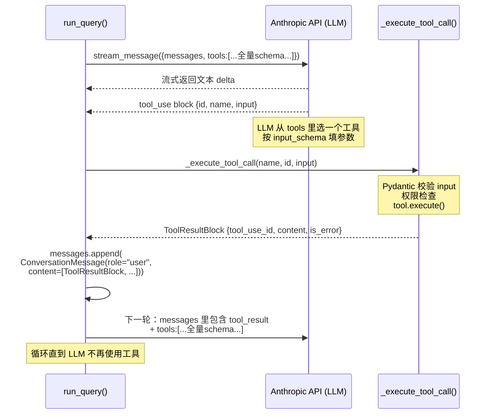
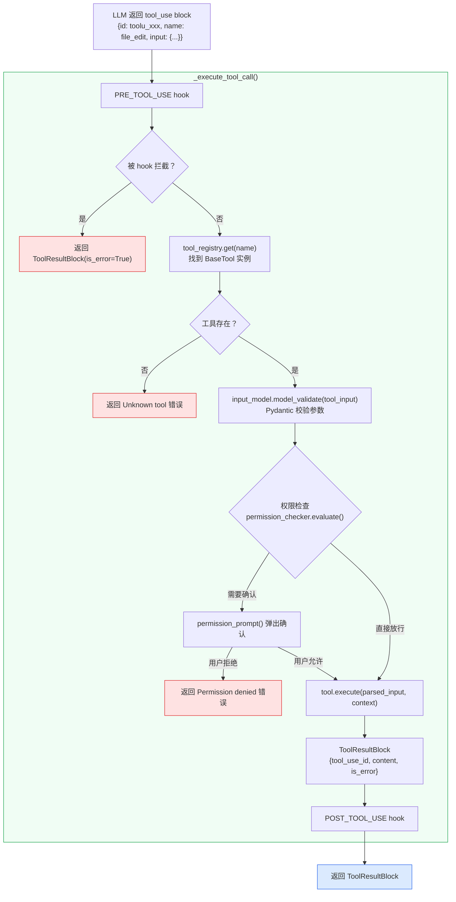
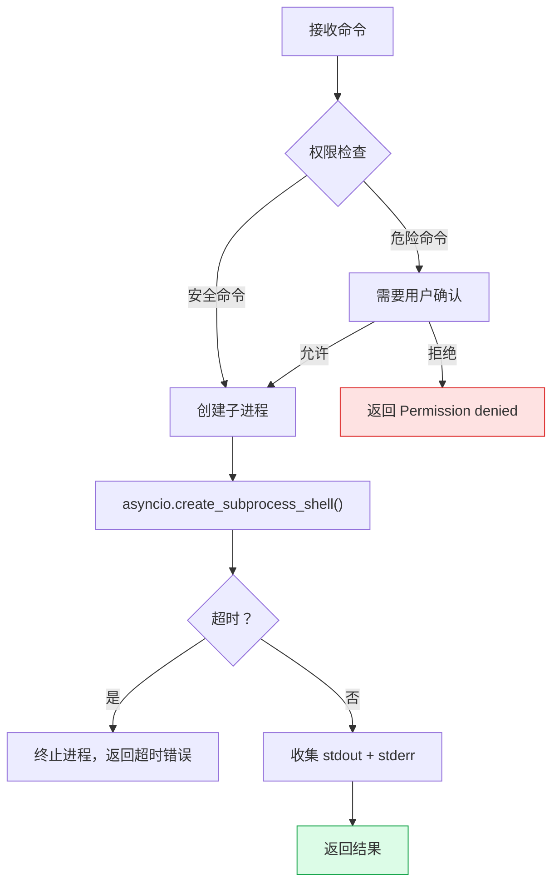

## 概述

OpenHarness 的所有 Agent 能力都以**工具 (Tool)** 的形式暴露——文件读写、代码搜索、终端执行、子 Agent 派发、MCP 协议调用……全部统一在 `BaseTool` 接口下。

LLM 通过 `tool_use` 声明调用哪个工具、传什么参数，引擎负责执行并返回结果。

---

## BaseTool 接口

> **文件**: `src/openharness/tools/base.py`

所有工具都继承自 `BaseTool` 抽象基类：

```python
class BaseTool(ABC):
    name: str                        # 工具唯一标识
    description: str                 # 注入 LLM 的描述（LLM 通过这个决定何时使用）
    input_model: type[BaseModel]     # Pydantic 输入校验模型

    @abstractmethod
    async def execute(self, arguments: BaseModel, 
                      context: ToolExecutionContext) -> ToolResult:
        """执行工具，返回结果"""

    def is_read_only(self, arguments: BaseModel) -> bool:
        """只读工具返回 True，权限系统据此自动放行"""
        return False

    def to_api_schema(self) -> dict:
        """转换为 LLM API 格式 {name, description, input_schema}"""
```

**设计要点**：
- `input_model` 是 Pydantic 模型，用于参数校验和 JSON Schema 生成（直接发给 LLM）
- `is_read_only()` 决定权限系统是否自动放行
- `ToolResult` 只有两个字段：`output: str` 和 `is_error: bool`

---

## ToolRegistry：注册表

```python
class ToolRegistry:
    _tools: dict[str, BaseTool]

    def register(tool: BaseTool)        # 按 tool.name 注册
    def get(name: str) -> BaseTool | None
    def list_tools() -> list[BaseTool]
    def to_api_schema() -> list[dict]   # 批量转成 LLM API 格式
```

### 注册流程



MCP 工具通过 `McpToolAdapter` 适配器包装，使得 MCP 服务器提供的工具与内置工具接口一致。

---

## 工具如何"注入"到 LLM 中

这是文档里最容易被忽略、却最关键的链路。每一次调用 LLM API，工具列表都会作为请求的一部分**整体传入**——这是 LLM 能够"知道"哪些工具可用的根本原因。

### 完整链路（代码级）



### 关键代码节点

**第 1 步：Pydantic → JSON Schema**（`base.py`）

```python
def to_api_schema(self) -> dict:
    return {
        "name": self.name,
        "description": self.description,
        "input_schema": self.input_model.model_json_schema(),  # ← Pydantic 自动生成
    }
```

`model_json_schema()` 会把 Pydantic 模型里每个字段的类型、`Field(description=...)` 全部转成标准 JSON Schema。以 `file_edit` 为例，实际发给 LLM 的结构是：

```json
{
  "name": "file_edit",
  "description": "...",
  "input_schema": {
    "type": "object",
    "properties": {
      "path":        { "type": "string", "description": "文件路径" },
      "old_str":     { "type": "string", "description": "要替换的原始字符串" },
      "new_str":     { "type": "string", "description": "替换后的新字符串" },
      "replace_all": { "type": "boolean", "default": false, "description": "是否替换所有匹配" }
    },
    "required": ["path", "old_str", "new_str"]
  }
}
```

LLM 正是通过这个 JSON Schema 知道每个参数叫什么名字、什么类型、什么含义——**`Field(description=...)` 写得好不好直接影响 LLM 调用工具的准确性**。

**第 2 步：注册表批量转换**（`base.py`）

```python
class ToolRegistry:
    def to_api_schema(self) -> list[dict]:
        return [tool.to_api_schema() for tool in self._tools.values()]
```

**第 3 步：每一轮都把全量工具传给 LLM**（`query.py` → `_stream_once`）

```python
# query.py: run_query() 中的对话循环
async for event in context.api_client.stream_message(
    ApiMessageRequest(
        model=context.model,
        messages=messages,
        system_prompt=context.system_prompt,
        max_tokens=context.max_tokens,
        tools=context.tool_registry.to_api_schema(),   # ← 每次 API 调用都带上完整工具列表
    )
):
    ...

# client.py: _stream_once() 里直接放进 Anthropic SDK 参数
if request.tools:
    params["tools"] = request.tools   # ← 原封不动传给 Anthropic API
```

<Info>
**为什么每轮都传一遍全量工具？**

Anthropic API 是无状态的——每次请求都是独立的 HTTP 调用，没有"会话"概念。要让 LLM 知道有哪些工具可用，只能每次都附上工具列表。这也意味着工具越多，每次请求消耗的 input token 越多。
</Info>

### 工具调用的完整往返



---

## 工具执行结果如何变成下一轮请求

### ToolResultBlock 的产生

`_execute_tool_call()` 在 `query.py` 里执行每一个工具调用，其内部步骤：



### 多工具并行执行

当 LLM 在一次响应里请求**多个工具**时（Anthropic API 允许），`run_query()` 会并发执行：

```python
# 单工具：顺序执行
if len(tool_calls) == 1:
    result = await _execute_tool_call(context, tc.name, tc.id, tc.input)
    tool_results = [result]

# 多工具：asyncio.gather 并发执行
else:
    raw_results = await asyncio.gather(
        *[_run(tc) for tc in tool_calls], return_exceptions=True
    )
    # 即使某个工具失败，其余工具的结果仍然保留
    # 防止 Anthropic API 收到没有对应 tool_result 的 tool_use（会报错）
```

### 结果打包成 user message

所有工具执行完毕后，把结果打包进一条 `role="user"` 的消息，追加到对话历史：

```python
messages.append(
    ConversationMessage(role="user", content=tool_results)
    # content = [ToolResultBlock, ToolResultBlock, ...]
)
```

### 序列化为 Anthropic wire format

下一轮调用 LLM 时，`ConversationMessage.to_api_param()` 把每个 `ToolResultBlock` 序列化为 API 要求的格式：

```python
# messages.py: serialize_content_block()
{
    "type": "tool_result",
    "tool_use_id": "toolu_abc123",   # ← 必须与 tool_use block 的 id 对应
    "content": "文件写入成功",
    "is_error": False
}
```

<Warning>
**Anthropic 的硬性要求**：每一个 `tool_use` block 必须有一个 `tool_use_id` 相同的 `tool_result` 回复，否则下一次 API 调用会报错。这就是为什么即使工具执行异常，代码里也用 `return_exceptions=True` 确保每个工具都有对应的错误结果，而不是丢掉它。
</Warning>

### 完整的消息序列示意

```
turn 1 — 用户输入：
  messages: [ {role:user, content:[TextBlock("帮我写个文件")]} ]

turn 2 — LLM 决定用工具：
  messages: [
    {role:user,      content:[TextBlock("帮我写个文件")]},
    {role:assistant, content:[TextBlock("好的"), ToolUseBlock(id="toolu_001", name="file_write", input:{...})]}
  ]

turn 3 — 工具结果回传：
  messages: [
    {role:user,      content:[TextBlock("帮我写个文件")]},
    {role:assistant, content:[TextBlock("好的"), ToolUseBlock(id="toolu_001", ...)]},
    {role:user,      content:[ToolResultBlock(tool_use_id="toolu_001", content="写入成功")]}
                               ↑ 必须与 toolu_001 对应
  ]

turn 4 — LLM 最终回复（不再调用工具）：
  LLM 看到工具执行成功，输出最终文本，stop
```

---

## 43+ 内置工具分类

<CardGroup cols={3}>
  <Card title="文件操作" icon="file">
    file_read, file_write, file_edit, glob
  </Card>
  <Card title="代码搜索" icon="magnifying-glass">
    grep, lsp
  </Card>
  <Card title="终端" icon="terminal">
    bash
  </Card>
  <Card title="Agent" icon="robot">
    agent, send_message
  </Card>
  <Card title="任务管理" icon="list-check">
    task_create, task_list, task_get, task_stop, task_update, task_output
  </Card>
  <Card title="团队协调" icon="users">
    team_create, team_delete
  </Card>
  <Card title="MCP" icon="plug">
    mcp_tool, mcp_auth, list_mcp_resources, read_mcp_resource
  </Card>
  <Card title="定时任务" icon="clock">
    cron_create, cron_list, cron_delete, cron_toggle
  </Card>
  <Card title="Web" icon="globe">
    web_search, web_fetch
  </Card>
  <Card title="技能" icon="bolt">
    skill, tool_search
  </Card>
  <Card title="Git" icon="code-branch">
    enter_worktree, exit_worktree
  </Card>
  <Card title="其他" icon="ellipsis">
    ask_user_question, brief, config, todo_write, sleep, notebook_edit
  </Card>
</CardGroup>

---

## 工具权限分类

权限系统根据工具的 `is_read_only()` 返回值和当前权限模式决定是否需要用户确认：

| 类别 | 示例工具 | DEFAULT 模式行为 |
|------|---------|----------------|
| **只读工具** | file_read, glob, grep, lsp, web_search | 自动放行，无需确认 |
| **修改性工具** | file_write, file_edit, bash（危险命令） | 需要用户确认 |
| **资源消耗型** | task_create, team_create, cron_create | 需要用户确认 |
| **安全敏感型** | mcp_auth, config（set 模式） | 需要用户确认 |
| **元控制工具** | enter_plan_mode, exit_plan_mode | 切换权限模式本身 |

<Info>
在 **FULL_AUTO** 模式下，所有工具自动放行。在 **PLAN** 模式下，所有修改性工具被阻止。
</Info>

---

## 核心工具实现详解

下面挑选几个有代表性的工具，深入分析其实现。

### file_edit_tool：精确字符串替换

**核心机制**：基于 `old_str → new_str` 的精确字符串替换，而非行号编辑。

```python
class FileEditInput(BaseModel):
    path: str = Field(..., description="文件路径")
    old_str: str = Field(..., description="要替换的原始字符串")
    new_str: str = Field(..., description="替换后的新字符串")
    replace_all: bool = Field(False, description="是否替换所有匹配")
```

**执行流程**：

<Steps>
  <Step title="读取文件内容">
    读取目标文件的完整内容到内存
  </Step>
  <Step title="查找匹配">
    在文件内容中搜索 `old_str` 的精确匹配。如果找到 0 个匹配返回错误；如果 `replace_all=False` 且找到多个匹配，也返回错误（避免歧义）
  </Step>
  <Step title="执行替换">
    用 `new_str` 替换 `old_str`
  </Step>
  <Step title="写回文件">
    将修改后的内容写回文件
  </Step>
</Steps>

**为什么用字符串替换而不是行号？**

行号编辑在多轮工具调用中容易出错——LLM 第一次编辑后行号发生偏移，后续编辑的行号就不准了。精确字符串匹配不受这个问题影响，且 LLM 可以直接从 `file_read` 的输出中复制要修改的片段。

---

### bash_tool：Shell 命令执行

**核心机制**：在独立子进程中执行 Shell 命令，带超时控制和安全检查。

```python
class BashInput(BaseModel):
    command: str = Field(..., description="Shell 命令")
    timeout_seconds: int = Field(600, description="超时时间", le=3600)
    cwd: str | None = Field(None, description="工作目录")
```

**执行流程**：



**安全特性**：
- **危险命令检测**：正则匹配 `rm -rf /`、`mkfs`、`dd` 等破坏性命令
- **超时保护**：默认 600s，最大 3600s，超时自动 SIGTERM → SIGKILL
- **cwd 限制**：工作目录受权限系统的路径规则约束
- **输出截断**：超大输出自动截断，防止 token 爆炸

---

### agent_tool：子 Agent 派发

**核心机制**：创建一个独立的子 Agent（拥有自己的 QueryEngine 和对话历史），在独立上下文中执行任务。

```python
class AgentInput(BaseModel):
    description: str = Field(..., description="任务描述")
    prompt: str = Field(..., description="Agent 提示词")
    model: str | None = Field(None, description="模型名称")
    subagent_type: str | None = Field(None, description="Agent 类型")
```

**执行流程**：

<Steps>
  <Step title="创建后台任务">
    通过 TaskManager 创建 `local_agent` 类型的后台任务
  </Step>
  <Step title="组装子 Agent 运行时">
    为子 Agent 创建独立的 RuntimeBundle（独立的 QueryEngine、消息历史、system prompt）
  </Step>
  <Step title="启动执行">
    子 Agent 在独立上下文中开始工作——它有自己的消息循环，可以调用工具、读写文件
  </Step>
  <Step title="返回任务 ID">
    父 Agent 拿到任务 ID，可以通过 `task_get` 查询进度、通过 `send_message` 发送消息
  </Step>
</Steps>

**关键设计**：
- 子 Agent 和父 Agent 共享同一个 `ToolRegistry` 和文件系统，但有独立的对话历史
- 通过 `Mailbox` 实现 Agent 间消息传递
- 支持多种后端：`subprocess`（子进程）、`in_process`（进程内）、`tmux`（可视化窗格）

---

### grep_tool：多线程代码搜索

**核心机制**：正则表达式搜索文件内容，支持多线程并行和结果分页。

```python
class GrepInput(BaseModel):
    pattern: str = Field(..., description="正则表达式")
    path: str | None = Field(None, description="搜索路径")
    file_glob: str = Field("**/*", description="文件过滤模式")
    case_sensitive: bool = Field(True, description="是否区分大小写")
    limit: int = Field(200, description="最大结果数")
```

**实现亮点**：
- **多线程搜索**：先用 `glob` 收集匹配文件，再并行搜索
- **结果分页**：`limit` + `offset` 支持大结果集的分页浏览
- **上下文显示**：每个匹配结果附带行号和上下文行
- **自动排除**：跳过 `.git/`、`node_modules/` 等目录

---

### web_fetch_tool：安全的网页获取

**核心机制**：获取网页内容并转为 LLM 友好的文本格式。

```python
class WebFetchInput(BaseModel):
    url: str = Field(..., description="网页 URL")
    max_chars: int = Field(12000, description="最大字符数")
```

**安全特性**：
- **协议限制**：拒绝 `file://` 协议，防止本地文件泄露
- **内网防护**：拒绝 `127.0.0.1`、`10.x.x.x` 等内网地址（SSRF 防护）
- **URL 验证**：检查 URL 合法性
- **输出截断**：超长内容自动截断到 `max_chars`

---

## 创建自定义工具

遵循 `BaseTool` 接口，创建自定义工具非常直观：

```python
from pydantic import BaseModel, Field
from openharness.tools.base import BaseTool, ToolExecutionContext, ToolResult

class MyToolInput(BaseModel):
    arg1: str = Field(..., description="参数1描述")
    arg2: int = Field(default=10, description="参数2描述")

class MyTool(BaseTool):
    name = "my_custom_tool"
    description = "工具描述，LLM 通过这个决定何时调用"
    input_model = MyToolInput

    async def execute(self, arguments: MyToolInput, 
                      context: ToolExecutionContext) -> ToolResult:
        result = f"Processed {arguments.arg1} with {arguments.arg2}"
        return ToolResult(output=result, is_error=False)

    def is_read_only(self, arguments: MyToolInput) -> bool:
        return True  # 只读工具
```

然后注册到 ToolRegistry：
```python
registry.register(MyTool())
```

**Pydantic 模型的 `Field(description=...)` 会自动转换为 JSON Schema，注入 LLM 的工具定义中**——LLM 通过这些描述理解每个参数的含义。

---

## ToolExecutionContext：执行上下文

工具执行时会收到一个上下文对象，包含运行时信息：

| 字段 | 说明 |
|------|------|
| `cwd` | 当前工作目录 |
| `metadata["tool_registry"]` | 工具注册表（工具可以调用其他工具） |
| `metadata["ask_user_prompt"]` | 向用户提问的回调（`ask_user_question` 工具使用） |
| `metadata["read_file_state"]` 等 | 跨轮次状态（来自 tool_metadata） |
| `hook_executor` | 钩子系统 |

<Tip>
`agent_tool` 正是通过 `metadata["tool_registry"]` 拿到工具注册表，为子 Agent 组装独立的运行时。
</Tip>

---

## 关键代码位置速查

| 功能 | 文件 |
|------|------|
| BaseTool 与 ToolRegistry | `src/openharness/tools/base.py` |
| 工具注册入口 | `src/openharness/tools/__init__.py` |
| file_read / file_write / file_edit | `src/openharness/tools/file_*.py` |
| bash_tool | `src/openharness/tools/bash_tool.py` |
| grep_tool | `src/openharness/tools/grep_tool.py` |
| agent_tool | `src/openharness/tools/agent_tool.py` |
| web_fetch / web_search | `src/openharness/tools/web_*.py` |
| MCP 工具适配器 | `src/openharness/tools/mcp_tool.py` |
| 工具执行入口 | `src/openharness/engine/query.py` (`_execute_tool_call`) |
